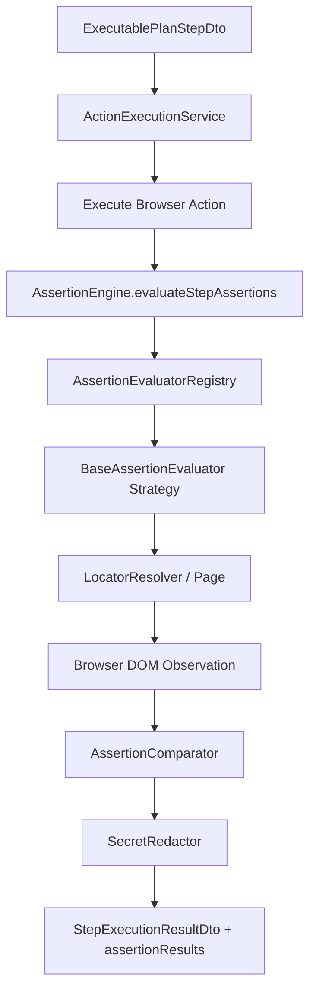

# V5 Phase 67 — Assertion & Expected-vs-Actual Verification Engine Architecture

## Overview

The **Assertion & Expected-vs-Actual Verification Engine** is the deterministic verification foundation for V5 Autonomous Web Testing. It decouples action execution from test evaluation, establishing the core invariant:

$$\text{Action Execution Succeeded} \neq \text{Test Passed}$$

A test step or run passes **only** when its observable browser runtime state strictly satisfies the formal expectations compiled from V4 requirement-traceable test cases.

---

## Key Principles & Guardrails

1. **Deterministic Verification Layer**:
   - Zero LLM runtime pass/fail judgment. Pass/Fail verdicts are strictly computed via deterministic DOM, state, text, and response comparisons.
2. **Hard vs. Soft Assertions**:
   - `isHard: true` (default): Step halts on first failure, marking step status as `FAILED`.
   - `isHard: false`: Soft assertion; failure is recorded in `assertionResults`, and subsequent step assertions continue evaluation.
3. **Verification Failure vs. Automation Error**:
   - `status: 'FAILED'` (`ASSERTION_FAILED`, `ASSERTION_TIMEOUT`): The application under test diverged from expected behavior.
   - `status: 'ERROR'` (`TARGET_NOT_FOUND`, `TARGET_AMBIGUOUS`, `PAGE_NOT_AVAILABLE`, `INVALID_EXPECTED_VALUE`, `MALFORMED_REGEX`, `UNRESOLVED_VARIABLE`): The test automation infrastructure or descriptor was invalid.
4. **Secret Redaction & Privacy**:
   - All expected and actual values, error messages, and URL parameters undergo automated token redaction via `SecretRedactor` before being returned or stored.
5. **Template Variable Resolution**:
   - Runtime variables formatted as `{{variableName}}` are dynamically resolved from context or the `RuntimeVariableManager`. Unresolvable variables throw `UnresolvedVariableError`, preventing false passes.

---

## Assertion Taxonomy & Operator Compatibility Matrix

| Category        | Assertion Types                                                                                                              | Supported Operators                                                                                | Default Operator                  | Description                                               |
| :-------------- | :--------------------------------------------------------------------------------------------------------------------------- | :------------------------------------------------------------------------------------------------- | :-------------------------------- | :-------------------------------------------------------- |
| **Visibility**  | `VISIBLE`, `HIDDEN`, `ELEMENT_VISIBLE`, `ELEMENT_HIDDEN`                                                                     | `VISIBLE`, `HIDDEN`, `EQUALS`, `NOT_EQUALS`                                                        | `VISIBLE` / `HIDDEN`              | Computes computed style, display, and layout visibility   |
| **Existence**   | `ELEMENT_EXISTS`, `ELEMENT_NOT_EXISTS`                                                                                       | `EXISTS`, `NOT_EXISTS`, `EQUALS`, `NOT_EQUALS`                                                     | `EXISTS` / `NOT_EXISTS`           | Computes DOM tree attachment regardless of visibility     |
| **State**       | `ENABLED`, `DISABLED`, `ELEMENT_ENABLED`, `ELEMENT_DISABLED`, `CHECKED`, `UNCHECKED`, `ELEMENT_CHECKED`, `ELEMENT_UNCHECKED` | `ENABLED`, `DISABLED`, `CHECKED`, `UNCHECKED`, `EQUALS`, `NOT_EQUALS`                              | Target state                      | Inspects interactive and form control states              |
| **Text**        | `TEXT_EQUALS`, `TEXT_CONTAINS`, `TEXT_MATCHES`                                                                               | `EQUALS`, `NOT_EQUALS`, `CONTAINS`, `NOT_CONTAINS`, `MATCHES`                                      | `EQUALS` / `CONTAINS` / `MATCHES` | Inner text, bounded string capture, and ReDoS-safe regex  |
| **Value**       | `VALUE_EQUALS`, `VALUE_CONTAINS`                                                                                             | `EQUALS`, `NOT_EQUALS`, `CONTAINS`, `NOT_CONTAINS`, `MATCHES`                                      | `EQUALS` / `CONTAINS`             | Form input, textarea, and select control values           |
| **URL & Title** | `URL_EQUALS`, `URL_CONTAINS`, `URL_MATCHES`, `TITLE_EQUALS`, `PAGE_TITLE_EQUALS`, `PAGE_TITLE_CONTAINS`                      | `EQUALS`, `NOT_EQUALS`, `CONTAINS`, `NOT_CONTAINS`, `MATCHES`                                      | `EQUALS` / `CONTAINS` / `MATCHES` | Page URL, path routing, query parameters, and title       |
| **Collections** | `COUNT_EQUALS`, `ELEMENT_COUNT_EQUALS`, `ELEMENT_COUNT_GREATER_THAN`, `ELEMENT_COUNT_LESS_THAN`                              | `EQUALS`, `NOT_EQUALS`, `GREATER_THAN`, `GREATER_THAN_OR_EQUAL`, `LESS_THAN`, `LESS_THAN_OR_EQUAL` | Match operator                    | Evaluates non-strict count of collection locators         |
| **Attributes**  | `ATTRIBUTE_EQUALS`, `ATTRIBUTE_CONTAINS`                                                                                     | `EQUALS`, `NOT_EQUALS`, `CONTAINS`, `NOT_CONTAINS`, `MATCHES`                                      | `EQUALS` / `CONTAINS`             | HTML element attributes (e.g. `aria-*`, `data-*`, `href`) |

---

## Architecture Pipeline

---

## Desktop IPC Integration

- Channel: `desktop:execution:assert` (`handleAssert`)
- Channel: `desktop:execution:evaluate-assertions` (`handleEvaluateStepAssertions`)
- Frame Isolation: Validated via `isTrustedIpcSender` preventing frame-injection or untrusted caller access.
