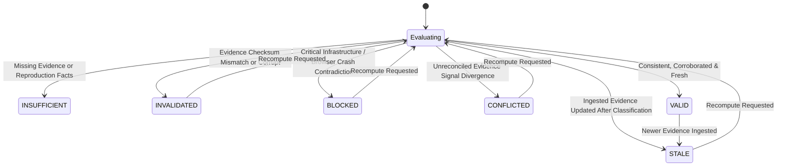

# V6 Phase 78 — Classification Decision Integrity, Cross-Evidence Arbitration & Runtime Enforcement Architecture

## 1. Executive Summary

Phase 78 introduces the **Classification Decision Integrity, Cross-Evidence Arbitration & Runtime Enforcement** subsystem to the AI-Driven Software Quality Engineering Platform.

Building strictly upon Phase 77's deterministic classification foundation, Phase 78 provides:

1. **Decision Integrity Binding**: Binds classification decisions to explicit historical evidence snapshots and reproduction outcome records.
2. **Deterministic Decision Fingerprint**: Computes an invariant SHA-256 hash across canonicalized evidence and reproduction facts, strictly purging non-deterministic variables and volatile credentials.
3. **Multi-Factor State Derivation**:
   - `DecisionIntegrityState`: `VALID`, `STALE`, `INVALIDATED`, `CONFLICTED`, `INSUFFICIENT`, `BLOCKED`.
   - `EvidenceFreshnessState`: `CURRENT`, `STALE`, `UNKNOWN`.
   - `DecisionConsistencyState`: `CONSISTENT`, `INCONSISTENT`, `UNKNOWN`.
   - `DecisionArbitrationState`: `SUPPORTED`, `OVERRIDDEN`, `CONFLICTED`, `UNKNOWN`.
4. **Cross-Evidence Arbitration Engine**: Implements a deterministic contradiction matrix arbitrating conflicting signals between execution errors, console/network telemetry, DOM state, and reproduction results.
5. **Non-Destructive Enforcement**: Maintains complete immutability of historical V5 execution truth ($E_1$), Phase 75 raw evidence, and Phase 77 deterministic classifications.
6. **Concurrency & Enterprise Security**: Guaranteed single-tenant isolation (0 cross-tenant leaks), top-frame IPC sender validation, atomic mutex serialization per failure case, and total credential redaction.

---

## 2. Mathematical Formalization & Fingerprint Derivation

### 2.1 Formal Model

Let:

- $F$ be a Failure Case within project tenant $P$.
- $E_1$ be the historical primary test execution fact: $E_1 = (s_{\text{fail}}, e_{\text{err}}, m_{\text{err}}, \tau_{\text{exec}})$.
- $C_F$ be the Phase 77 deterministic failure classification: $C_F = (K, \sigma, D, \chi)$.
- $\mathcal{E}$ be the normalized evidence bundle from Phase 75: $\mathcal{E} = \{e_1, e_2, \dots, e_n\}$.
- $\mathcal{R}$ be the reproduction outcome fact from Phase 76: $\mathcal{R} = (status, \Delta_E, \sigma_R)$.

The decision integrity evaluation function is defined as:
$$\Phi(C_F, \mathcal{E}, \mathcal{R}) \to (\mathcal{I}, \mathcal{S}_{\text{fresh}}, \mathcal{S}_{\text{consist}}, \mathcal{S}_{\text{arbit}}, \phi_{\text{fingerprint}})$$

where:

- $\mathcal{I} \in \{\text{VALID}, \text{STALE}, \text{INVALIDATED}, \text{CONFLICTED}, \text{INSUFFICIENT}, \text{BLOCKED}\}$
- $\mathcal{S}_{\text{fresh}} \in \{\text{CURRENT}, \text{STALE}, \text{UNKNOWN}\}$
- $\mathcal{S}_{\text{consist}} \in \{\text{CONSISTENT}, \text{INCONSISTENT}, \text{UNKNOWN}\}$
- $\mathcal{S}_{\text{arbit}} \in \{\text{SUPPORTED}, \text{OVERRIDDEN}, \text{CONFLICTED}, \text{UNKNOWN}\}$
- $\phi_{\text{fingerprint}} \in [0-9a-f]^{64}$ (SHA-256)

### 2.2 Canonical Fingerprint Derivation

The decision fingerprint $\phi_{\text{fingerprint}}$ represents the invariant cryptographic digest of the decision basis.

```
+-------------------------------------------------------------+
|               Canonical Payload Components                  |
+-------------------------------------------------------------+
| 1. failureCaseId (UUID)                                     |
| 2. classificationCategory (String)                          |
| 3. primaryReason (Redacted, Trimmed)                        |
| 4. rulesApplied (Alphabetically Sorted Array of Strings)    |
| 5. evidenceItems: Array of Canonical Evidence Summaries:    |
|    - artifactType                                           |
|    - integrityStatus                                        |
|    - sha256Checksum                                         |
|    (Sorted by artifactType ASC, sha256Checksum ASC)         |
| 6. reproductionSummary (Optional Object):                   |
|    - status                                                 |
|    - environmentEquivalence                                 |
|    - signatureMatched                                       |
+-------------------------------------------------------------+
                              |
                              v
             [Canonical JSON Serialization]
       (Recursively sorted object keys, no spaces)
                              |
                              v
             [SHA-256 Cryptographic Digest]
                              |
                              v
                    decisionFingerprint
```

**Secret Redaction Rules**:

- Passwords, authorization headers, bearer tokens, API keys, and session cookies are redacted to `[REDACTED]` prior to hashing.
- Execution timestamps, volatile local process IDs, and memory addresses are excluded to guarantee cross-machine reproducibility.

---

## 3. Cross-Evidence Arbitration Contradiction Matrix

The `CrossEvidenceArbitrationEngine` arbitrates contradictory signals across heterogenous evidence modalities:

| Primary Classification Category | Evidence / Reproduction Signal                                | Conflict Detected? | Arbitration State | Decision Integrity State | Blocking / Contradiction Reason                                                            |
| :------------------------------ | :------------------------------------------------------------ | :----------------- | :---------------- | :----------------------- | :----------------------------------------------------------------------------------------- |
| `APPLICATION_FAILURE`           | Page crash / browser crashed console log                      | YES                | `CONFLICTED`      | `BLOCKED`                | Browser process crash recorded; conflicts with pure application logic failure assertion.   |
| `APPLICATION_FAILURE`           | Connection refused / DNS failure network log                  | YES                | `CONFLICTED`      | `BLOCKED`                | Environment infrastructure unreachable; conflicts with application failure classification. |
| `ENVIRONMENT_INFRASTRUCTURE`    | Reproduction status is `NOT_REPRODUCED` & environment `EXACT` | YES                | `CONFLICTED`      | `CONFLICTED`             | Environmental issue could not be reproduced under identical environment conditions.        |
| `ENVIRONMENT_INFRASTRUCTURE`    | Missing required target URL / connection error                | NO                 | `SUPPORTED`       | `VALID`                  | Corroborated by missing endpoint network trace.                                            |
| `TEST_DATA_DEFECT`              | Record not found / foreign key violation in logs              | NO                 | `SUPPORTED`       | `VALID`                  | Database/entity state error corroborates test data precondition failure.                   |
| `TEST_DATA_DEFECT`              | Clean network 200 OK across all calls & DOM intact            | YES                | `CONFLICTED`      | `CONFLICTED`             | No data mutation or query failure found in telemetry.                                      |
| Any Category                    | Ingestion integrity `MISMATCH` or `CORRUPT`                   | N/A                | `CONFLICTED`      | `INVALIDATED`            | Evidence integrity compromised; cannot substantiate classification.                        |
| Any Category                    | Zero evidence items ingested                                  | N/A                | `UNKNOWN`         | `INSUFFICIENT`           | Minimum required evidence threshold not satisfied.                                         |

---

## 4. Multi-Factor Integrity State Machine



### 4.1 Transition Conditions

1. **INSUFFICIENT**: Triggered when zero evidence artifacts exist for the failure case.
2. **INVALIDATED**: Triggered when any required evidence artifact exhibits an integrity status of `CORRUPT` or `MISMATCH`.
3. **BLOCKED**: Triggered when an irreconcilable high-severity contradiction exists (such as browser core dump or unreachable network when classified as application code defect).
4. **CONFLICTED**: Triggered when reproduction facts contradict historical classification rules without infrastructure block.
5. **STALE**: Triggered when evidence was modified or added after `classification.classifiedAt`.
6. **VALID**: Triggered when all evidence is verified, freshness is current, arbitration state is supported, and consistency is corroborated.

---

## 5. Database Schema Specification

```prisma
enum DecisionIntegrityState {
  VALID
  STALE
  INVALIDATED
  CONFLICTED
  INSUFFICIENT
  BLOCKED
}

enum EvidenceFreshnessState {
  CURRENT
  STALE
  UNKNOWN
}

enum DecisionConsistencyState {
  CONSISTENT
  INCONSISTENT
  UNKNOWN
}

enum DecisionArbitrationState {
  SUPPORTED
  OVERRIDDEN
  CONFLICTED
  UNKNOWN
}

model ClassificationDecisionIntegrity {
  id                      String                   @id @default(uuid())
  projectId               String
  failureCaseId           String
  classificationId        String
  integrityState          DecisionIntegrityState   @default(VALID)
  freshnessState          EvidenceFreshnessState   @default(CURRENT)
  consistencyState        DecisionConsistencyState @default(CONSISTENT)
  arbitrationState        DecisionArbitrationState @default(SUPPORTED)
  decisionFingerprint     String
  evaluatedAt             DateTime                 @default(now())
  evidenceSnapshotJson    Json
  reproductionSnapshotJson Json?
  arbitrationReason       String?
  contradictionMatrixJson Json?
  blockingReasonsJson     Json
  isAuthoritative         Boolean                  @default(true)
  recomputationCount      Int                      @default(0)
  lastRecomputedAt        DateTime?
  invalidatedAt           DateTime?
  invalidationReason      String?
  materialChangesJson     Json?
  createdAt               DateTime                 @default(now())
  updatedAt               DateTime                 @updatedAt

  project                 Project                  @relation(fields: [projectId], references: [id], onDelete: Cascade)
  failureCase             FailureCase              @relation(fields: [failureCaseId], references: [id], onDelete: Cascade)
  classification          FailureClassification   @relation(fields: [classificationId], references: [id], onDelete: Cascade)

  @@index([projectId, failureCaseId, isAuthoritative])
  @@index([decisionFingerprint])
  @@index([integrityState])
}
```

---

## 6. IPC Interface & Preload Contract

### 6.1 IPC Channels

- `failures:evaluateDecisionIntegrity` (`FAILURES_EVALUATE_DECISION_INTEGRITY`):
  Evaluates and stores decision integrity for a failure case.
- `failures:getDecisionIntegrity` (`FAILURES_GET_DECISION_INTEGRITY`):
  Idempotent read returning the authoritative decision integrity record without mutating state.
- `failures:recomputeDecisionIntegrity` (`FAILURES_RECOMPUTE_DECISION_INTEGRITY`):
  Explicit operator or pipeline recomputation forcing archive of past records and generation of fresh authoritative state.
- `failures:listDecisionIntegrityHistory` (`FAILURES_LIST_DECISION_INTEGRITY_HISTORY`):
  Retrieves chronological historical integrity evaluations for audit trails.

### 6.2 Preload API

```typescript
window.desktop.failures.evaluateDecisionIntegrity(input: EvaluateDecisionIntegrityInput): Promise<ClassificationDecisionIntegrityDto>;
window.desktop.failures.getDecisionIntegrity(input: GetDecisionIntegrityInput): Promise<ClassificationDecisionIntegrityDto | null>;
window.desktop.failures.recomputeDecisionIntegrity(input: RecomputeDecisionIntegrityInput): Promise<ClassificationDecisionIntegrityDto>;
window.desktop.failures.listDecisionIntegrityHistory(input: ListDecisionIntegrityHistoryInput): Promise<ClassificationDecisionIntegrityDto[]>;
```

---

## 7. Security Controls & Concurrency Guarantees

1. **Multi-Tenant Isolation**: Every database query and service action enforces `projectId`. Accessing a failure case or classification across projects throws `DecisionIntegrityCrossProjectError` and returns `FORBIDDEN`.
2. **IPC Sender Validation**: All IPC handlers validate `event.senderFrame` via `validateIpcSender()`. Requests from unauthorized origins or non-top frames are rejected immediately.
3. **Mass Assignment Prevention**: DTO mappings explicitly construct domain objects. Unvetted fields from client inputs are discarded.
4. **Mutex Concurrency Locking**: In-memory async mutex serializes all state-mutating evaluations per failure case (`${projectId}:${failureCaseId}`). Prevents concurrent race conditions or dual authoritative record creation.
5. **Database Transaction Isolation**: Archival of previous authoritative records and creation of new records occurs within Prisma interactive transactions.
