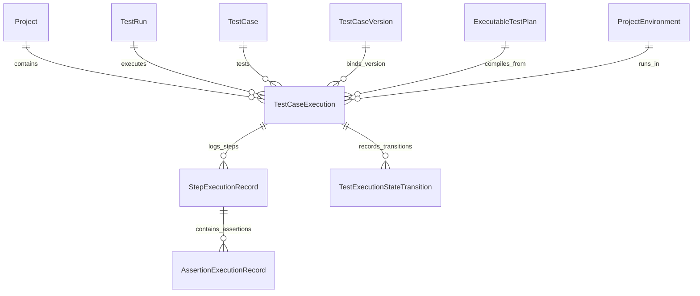

# V5 Phase 68 — Execution Persistence & Step-Level Audit Trail Specification

## 1. Executive Summary & Purpose

Phase 68 delivers an authoritative, write-ahead persistence and step-level audit trail architecture for autonomous web test execution.
Execution histories in the AI-Driven Software Quality Engineering Platform are **immutable audit records**. Executing a test case ten times produces ten distinct, auditable execution records—never overwriting historical truth.

Key Architectural Guarantees:

- **Write-Ahead Durability**: Step starts and completions are recorded incrementally to prevent data loss on unexpected termination.
- **Strict Version Binding**: Every execution attempt is immutably bound to the specific `testCaseVersionId` and `testCaseVersionNumber` that was executed.
- **Authoritative Sequencing**: Steps are recorded with exact 1-indexed `stepIndex` sequence ordering and explicit retry/attempt tracking (`attempt >= 1`).
- **Terminal State Protection**: Once an execution transitions into a terminal status (`PASSED`, `FAILED`, `CANCELLED`, `AUTOMATION_ERROR`, `BLOCKED`), it cannot transition back to active states or different terminal states.
- **Secret Redaction**: Passwords, API tokens, Authorization headers, and session credentials are securely masked to `***` before database writes.
- **Startup Crash Reconciliation**: Upon application startup or daemon reboot, stale `PREPARING` or `RUNNING` executions are automatically reconciled to `AUTOMATION_ERROR` with auditable reason codes (`PROCESS_INTERRUPTED`).
- **Unified Chronological Timeline**: Complete test lifecycle reconstruction from run queued events, state transitions, step actions, and assertion evaluations.

---

## 2. Database Entities & Relationships



### Entity Definitions

1. `TestCaseExecution` (`test_case_executions`):
   - `id`: UUID Primary Key
   - `projectId`: UUID Foreign Key
   - `testRunId`: UUID Foreign Key
   - `testCaseId`: UUID Foreign Key
   - `testCaseVersionId`: UUID Foreign Key (nullable)
   - `testCaseVersionNumber`: Int (authoritative version executed)
   - `executableTestPlanId`: UUID Foreign Key
   - `environmentId`: UUID Foreign Key (nullable)
   - `attempt`: Int (default 1)
   - `status`: Enum (`PREPARING`, `RUNNING`, `PASSED`, `FAILED`, `BLOCKED`, `AUTOMATION_ERROR`, `CANCELLED`)
   - `startedAt`, `completedAt`: Timestamps
   - `durationMs`: Non-negative execution duration in milliseconds
   - `terminalReason`: Text explanation of terminal state
   - `errorMessage`, `errorCode`: Error taxonomy metadata
   - `browserEngine`: String (`chromium`, `firefox`, `webkit`)
   - `environmentSnapshotJson`: Redacted environment parameters
   - `metadataJson`: Structured runtime diagnostic metadata

2. `StepExecutionRecord` (`step_execution_records`):
   - `id`: UUID Primary Key
   - `projectId`, `testRunId`, `executionId`: UUID Foreign Keys
   - `sourceStepId`: UUID (optional link to plan step)
   - `stepIndex`: Int (1-indexed sequence order)
   - `attempt`: Int (default 1, per-step retry tracking)
   - `actionType`: String (e.g., `NAVIGATE`, `CLICK`, `FILL`, `SELECT_OPTION`, `ASSERT`)
   - `status`: Enum (`PENDING`, `RUNNING`, `PASSED`, `FAILED`, `BLOCKED`, `AUTOMATION_ERROR`, `SKIPPED`, `CANCELLED`)
   - `startedAt`, `completedAt`: Timestamps
   - `durationMs`: Duration in milliseconds
   - `targetSummary`: Redacted selector or target element description
   - `actionDataJson`: Redacted action parameters
   - `expectedSummary`, `actualSummary`: Expected vs. actual textual summaries
   - `errorCode`, `errorMessage`: Redacted error information
   - `metadataJson`: Step execution telemetry

3. `AssertionExecutionRecord` (`assertion_execution_records`):
   - `id`: UUID Primary Key
   - `projectId`, `testRunId`, `executionId`, `stepExecutionId`: UUID Foreign Keys
   - `sourceAssertionId`: UUID (optional link to compiled assertion)
   - `assertionType`: String (`ELEMENT_VISIBLE`, `TEXT_EQUALS`, `URL_EQUALS`, etc.)
   - `operator`: String (`VISIBLE`, `EQUALS`, `CONTAINS`, `MATCHES_REGEX`, etc.)
   - `status`: String (`PASSED`, `FAILED`, `ERROR`, `CANCELLED`, `UNSUPPORTED`)
   - `isHard`: Boolean (true halts execution on failure)
   - `targetSummary`: Redacted target summary
   - `expectedValueJson`, `actualValueJson`: Redacted expected and actual values
   - `message`, `errorCode`, `errorMessage`: Detailed failure messages
   - `durationMs`: Evaluation latency
   - `evaluatedAt`: Evaluation timestamp

4. `TestExecutionStateTransition` (`test_execution_state_transitions`):
   - `id`: UUID Primary Key
   - `projectId`, `testRunId`, `executionId`: UUID Foreign Keys
   - `fromStatus`: `TestRunStatus` (nullable for initial transition)
   - `toStatus`: `TestRunStatus`
   - `reason`: Explanation for transition
   - `metadataJson`: Transition context
   - `transitionedAt`: Timestamp

---

## 3. Core Domain Architecture

```
packages/core/src/execution/persistence/
├── execution-persistence-types.ts      # Bounds, constants, interface definitions
├── execution-persistence-errors.ts     # Domain error taxonomy (404, 400, 409, 403)
├── execution-persistence-service.ts    # Authoritative persistence & timeline service
└── index.ts                            # Public exports and singleton factory
```

### IPC Channels & Desktop Bridge API

| IPC Channel                               | Desktop Bridge Method                                         | Description                                                   |
| ----------------------------------------- | ------------------------------------------------------------- | ------------------------------------------------------------- |
| `desktop:executionHistory:getExecution`   | `window.desktop.executionHistory.getExecution(input)`         | Retrieves single execution attempt with steps and transitions |
| `desktop:executionHistory:listExecutions` | `window.desktop.executionHistory.listExecutions(input)`       | Paginated list of historical executions with project scoping  |
| `desktop:executionHistory:getSteps`       | `window.desktop.executionHistory.getExecutionSteps(input)`    | Paginated list of step execution records for an execution     |
| `desktop:executionHistory:getTimeline`    | `window.desktop.executionHistory.getExecutionTimeline(input)` | Unified chronological audit timeline                          |
| `desktop:executionHistory:reconcile`      | `window.desktop.executionHistory.reconcileOrphaned(input)`    | Startup crash recovery for abandoned active executions        |

---

## 4. Verification & Certification

- **Unit & Security Tests**: 15 tests across 8 suites passing with 0 failures.
- **Regression Suite**: Platform-wide test suite passing with 0 failures.
- **Strict Bounds**: All summaries and error codes clamped to bounded sizes.
- **Secret Redaction**: Passwords and sensitive tokens are completely redacted before persistence.
