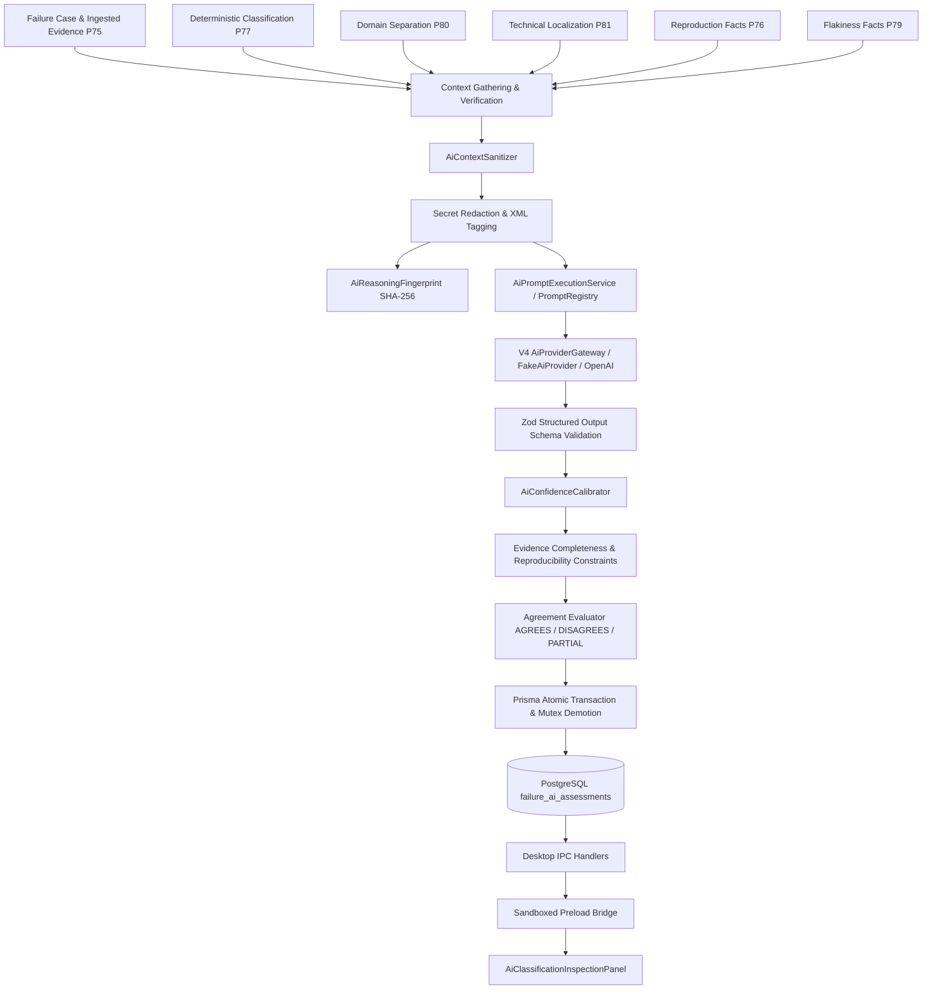

# V6 Phase 82 — AI-Assisted Failure Classification & Reasoning Architecture

## 1. Executive Summary

Phase 82 introduces the **AI-Assisted Failure Classification & Reasoning Subsystem** to the AI-Driven Software Quality Engineering Platform.

Operating as an **advisory intelligence layer**, Phase 82 ingests the rich, verified facts produced by the upstream deterministic pipeline:

- **Phase 74**: Failure Intelligence Domain & Case Management
- **Phase 75**: Evidence Ingestion, Normalization & Integrity Validation
- **Phase 76**: Controlled Failure Reproduction & Verification
- **Phase 77**: Failure Taxonomy & Deterministic Rules-Based Classification
- **Phase 78**: Classification Decision Integrity & Arbitration
- **Phase 79**: Failure Flakiness Intelligence
- **Phase 80**: Failure Domain Separation
- **Phase 81**: Failure Evidence Correlation & Technical Cause Localization
- **V2**: Indexed Repository Route & Symbol Linking
- **V4**: Managed AI Gateway & Structured Prompt Execution

Phase 82 provides high-level semantic reasoning, explains why a failure occurred, validates deterministic conclusions, and surfaces alternative hypotheses—all while adhering to the core architectural guarantee that **deterministic pipeline decisions are authoritative and immutable**.

---

## 2. Core Design Principles & Non-Negotiable Guarantees

1. **Advisory Role**:
   - The AI reasoning layer is strictly advisory. It never overwrites, demotes, or replaces the authoritative deterministic classification (`FailureClassification`) or execution records ($E_1$).
2. **Explicit Agreement State**:
   - The AI assessment explicitly records its relationship with the deterministic baseline via `ClassificationAgreement`:
     - `AGREES`: AI classification matches the deterministic category.
     - `DISAGREES`: AI classification differs from the deterministic category.
     - `PARTIAL_AGREEMENT`: AI agrees with deterministic classification domain or one of the categories is `INCONCLUSIVE`.
     - `NOT_COMPARABLE`: Baseline deterministic classification was not present or comparison was infeasible.
3. **Strict Taxonomy Conformance**:
   - AI outputs are restricted strictly to the 9 canonical categories defined in `FailureCategory`:
     `APPLICATION_FAILURE`, `AUTOMATION_FAILURE`, `TEST_DATA_FAILURE`, `ENVIRONMENT_FAILURE`, `REQUIREMENT_AMBIGUITY`, `INVALID_TEST`, `BLOCKED_EXECUTION`, `INCONCLUSIVE`, `UNCLASSIFIED`.
4. **Bounded, Explainable Confidence Calibration**:
   - The raw confidence score from the LLM is never trusted blindly. It is deterministically calibrated using empirical factors:
     - Evidence Completeness Factor (0.0 to 1.0 based on available diagnostic signals).
     - Reproduction Consistency Factor (0.0 to 1.0 based on Phase 76 multi-run consistency).
     - Environment Equivalence Factor (0.0 to 1.0 based on verified browser/OS target fidelity).
     - Contradictory Signals Penalty (-0.10 per conflicting signal).
   - Strict ceilings and floors are enforced:
     - Evidence completeness $< 40\% \implies$ confidence capped at `MEDIUM` ($\le 0.65$).
     - $\ge 2$ contradictory signals $\implies$ confidence capped at `MEDIUM` ($\le 0.65$).
     - 0 supporting evidence items $\implies$ confidence capped at `LOW` ($\le 0.35$).
5. **Multi-Tenant Security & Isolation**:
   - Every read, write, and reassessment operation verifies project ownership against the target `FailureCase`. Mismatched project access is immediately rejected with `AiAssessmentCrossProjectError`.
6. **Robust Prompt-Injection Defense**:
   - All untrusted execution telemetry, error strings, DOM snippets, and network URLs are wrapped inside passive, structured XML-like tags:
     - `<untrusted_execution_details>`
     - `<untrusted_execution_evidence>`
     - `<untrusted_deterministic_baseline>`
     - `<untrusted_domain_separation>`
     - `<untrusted_technical_localization>`
     - `<untrusted_reproduction_facts>`
     - `<untrusted_flakiness_facts>`
   - All authorization tokens, passwords, bearer credentials, cookies, and database credentials are fully redacted before prompt formatting using `FailureEvidenceRedactor`.
7. **Dynamic Staleness Detection on Read**:
   - Reads via `getAiAssessment` do **not** trigger expensive LLM calls.
   - Dynamic staleness checks compare timestamps: if newer evidence, re-classifications, re-evaluations, or re-localizations exist after `assessedAt`, the record is marked `isStale = true` with an explanatory `stalenessReason`.
8. **Serialized Mutex Concurrency**:
   - Concurrent requests for the same `failureCaseId` are serialized using an in-memory Promise mutex (`withLock`). When multiple callers request assessment simultaneously, only one LLM call executes while the second caller receives the fresh result without duplicate execution or race conditions.

---

## 3. Database Schema

Phase 82 introduces the `FailureAiAssessment` model and supporting enums in Prisma (`prisma/schema.prisma`):

```prisma
enum ClassificationAgreement {
  AGREES
  DISAGREES
  PARTIAL_AGREEMENT
  NOT_COMPARABLE
}

enum AiConfidenceLevel {
  VERY_LOW
  LOW
  MEDIUM
  HIGH
  VERY_HIGH
}

model FailureAiAssessment {
  id                             String                  @id @default(uuid())
  projectId                      String                  @map("project_id")
  failureCaseId                  String                  @map("failure_case_id")
  testCaseId                     String                  @map("test_case_id")
  testCaseVersionNumber          Int                     @map("test_case_version_number")
  failureAnalysisRunId           String?                 @map("failure_analysis_run_id")
  deterministicClassificationId  String?                 @map("deterministic_classification_id")
  technicalLocalizationId        String?                 @map("technical_localization_id")
  domainSeparationId             String?                 @map("domain_separation_id")

  // AI Classification & Agreement
  aiCategory                     FailureCategory         @map("ai_category")
  aiSubcategory                  FailureSubcategory?     @map("ai_subcategory")
  agreementState                 ClassificationAgreement @map("agreement_state")

  // Calibrated Confidence
  confidenceLevel                AiConfidenceLevel       @map("confidence_level")
  confidenceScore                Float                   @map("confidence_score")
  rawConfidenceScore             Float?                  @map("raw_confidence_score")
  calibrationBasis               String[]                @default([]) @map("calibration_basis")
  evidenceCompletenessFactor     Float?                  @map("evidence_completeness_factor")
  reproductionConsistencyFactor  Float?                  @map("reproduction_consistency_factor")

  // Structured Explanations
  primaryReasoning               String                  @db.Text @map("primary_reasoning")
  humanExplanation               String                  @db.Text @map("human_explanation")
  supportingEvidence             Json                    @default("[]") @map("supporting_evidence")
  contradictingEvidence          Json                    @default("[]") @map("contradicting_evidence")
  alternativeHypotheses          Json                    @default("[]") @map("alternative_hypotheses")
  uncertainties                  String[]                @default([]) @map("uncertainties")
  recommendations                String[]                @default([]) @map("recommendations")

  // Lineage, Fingerprinting & Model Provenance
  assessmentFingerprint          String                  @map("assessment_fingerprint")
  isAuthoritative                Boolean                 @default(true) @map("is_authoritative")
  isStale                        Boolean                 @default(false) @map("is_stale")
  stalenessReason                String?                 @map("staleness_reason")
  reanalysisCount                Int                     @default(0) @map("reanalysis_count")
  lastReanalyzedAt               DateTime?               @map("last_reanalyzed_at")
  reanalysisReason               String?                 @map("reanalysis_reason")
  supersededById                 String?                 @map("superseded_by_id")
  modelProvider                  String                  @map("model_provider")
  modelName                      String                  @map("model_name")
  promptVersion                  Int                     @map("prompt_version")

  assessedAt                     DateTime                @default(now()) @map("assessed_at")
  createdAt                      DateTime                @default(now()) @map("created_at")
  updatedAt                      DateTime                @updatedAt @map("updated_at")

  // Relations
  project                        Project                 @relation(fields: [projectId], references: [id], onDelete: Cascade)
  failureCase                    FailureCase             @relation(fields: [failureCaseId], references: [id], onDelete: Cascade)
  testCase                       TestCase                @relation(fields: [testCaseId], references: [id], onDelete: Cascade)
  failureAnalysisRun             FailureAnalysisRun?     @relation(fields: [failureAnalysisRunId], references: [id], onDelete: SetNull)
  deterministicClassification    FailureClassification?  @relation(fields: [deterministicClassificationId], references: [id], onDelete: SetNull)
  domainSeparation               FailureDomainSeparation? @relation(fields: [domainSeparationId], references: [id], onDelete: SetNull)
  technicalLocalization         FailureTechnicalLocalization? @relation(fields: [technicalLocalizationId], references: [id], onDelete: SetNull)

  @@index([projectId])
  @@index([failureCaseId])
  @@index([isAuthoritative])
  @@index([assessmentFingerprint])
  @@map("failure_ai_assessments")
}
```

---

## 4. Subsystem Architecture



### 4.1 Subsystem Components

1. **`ai-reasoning-types.ts`**:
   - Contains domain types, interfaces, bounded constants (`AI_ASSESSMENT_BOUNDS`), and structured output interfaces.
2. **`ai-context-sanitizer.ts`**:
   - Enforces strict string length boundaries, redacts secrets using `FailureEvidenceRedactor`, strips control characters and backticks, and renders passive `<untrusted_...>` blocks.
3. **`ai-reasoning-fingerprint.ts`**:
   - Produces a canonical 64-character SHA-256 hex fingerprint invariant to hash ordering.
4. **`ai-confidence-calibrator.ts`**:
   - Bounded multi-factor calibration engine calculating `evidenceCompleteness`, `reproductionConsistency`, `environmentEquivalence`, and applying `contradictorySignalsCount` penalties.
5. **`ai-classification-prompt-definition.ts`**:
   - Prompt definition for `failure.ai.classification` version 1 registered in `PromptRegistry`.
6. **`failure-ai-reasoning-service.ts`**:
   - The central orchestrator implementing `IFailureAiReasoningService`, featuring mutex serialization, dynamic staleness checking, transaction management, and lineage tracking.

---

## 5. Desktop Application & UI Integration

### 5.1 IPC Channels & Error Handling

Four secure IPC channels are exposed in `DESKTOP_CHANNELS`:

- `FAILURES_ASSESS_WITH_AI` (`failures:assessWithAi`)
- `FAILURES_GET_AI_ASSESSMENT` (`failures:getAiAssessment`)
- `FAILURES_REASSESS_WITH_AI` (`failures:reassessWithAi`)
- `FAILURES_LIST_AI_ASSESSMENT_HISTORY` (`failures:listAiAssessmentHistory`)

Registered error codes in `DesktopErrorCode`:

- `AI_ASSESSMENT_NOT_FOUND`
- `AI_ASSESSMENT_STALE`
- `AI_ASSESSMENT_UNAVAILABLE`
- `AI_ASSESSMENT_INSUFFICIENT_EVIDENCE`
- `AI_ASSESSMENT_BLOCKED`
- `AI_ASSESSMENT_CROSS_PROJECT`
- `AI_ASSESSMENT_CONCURRENT_MUTATION`

### 5.2 Preload Bridge

Exposed on `window.desktop.failures`:

```typescript
assessWithAi: (input: AssessFailureWithAiInputDto) =>
  Promise<DesktopResponse<FailureAiAssessmentDto>>;
getAiAssessment: (input: GetFailureAiAssessmentInputDto) =>
  Promise<DesktopResponse<FailureAiAssessmentDto | null>>;
reassessWithAi: (input: ReassessFailureWithAiInputDto) =>
  Promise<DesktopResponse<FailureAiAssessmentDto>>;
listAiAssessmentHistory: (input: ListFailureAiAssessmentHistoryInputDto) =>
  Promise<DesktopResponse<readonly FailureAiAssessmentDto[]>>;
```

### 5.3 Inspection Panel UI

The `AiClassificationInspectionPanel` is embedded into `FailureCasesListView.tsx` as the `🤖 AI Reasoning (Phase 82)` tab. It features:

- **Agreement State Badge**: Prominent display with color coding:
  - Green for `AGREES` (AI agrees with deterministic pipeline).
  - Amber for `DISAGREES` (AI suggests alternative failure category).
  - Blue for `PARTIAL_AGREEMENT` (Partial agreement or inconclusive baseline).
- **Calibrated Confidence Meter**: Visual percentage bar, calibrated tier badge (`VERY_LOW`, `LOW`, `MEDIUM`, `HIGH`, `VERY_HIGH`), and expandable calibration basis factors.
- **Executive Summary & Technical Reasoning**: Readable summary and in-depth explanation with monospace styling.
- **Supporting vs. Contradicting Evidence Cards**: Side-by-side cards illustrating corroborating evidence and contradictory tensions.
- **Alternative Hypotheses Accordion**: Shows secondary categories considered by AI with plausibility ratings and disqualifying facts.
- **Dynamic Staleness Banner**: Warns the operator when upstream telemetry has changed since assessment, providing an instant 1-click re-assessment trigger.
- **Reassessment Modal**: Requires a mandatory operator audit justification (`reanalysisReason`) prior to executing reassessment.
- **Lineage History Drawer**: Shows past superseded assessments with timestamps and audit reasons.

---

## 6. Verification & Certification Evidence

### 6.1 Quality Gates Executed

1. **Typecheck**:
   - `npm run typecheck` (`tsc -b`): **0 errors**.
2. **ESLint**:
   - `npx eslint --quiet ...`: **0 errors, 0 warnings**.
3. **Desktop Application Build & Smoke**:
   - `npm run desktop:build`: Succeeded, bundling preload script and Vite renderer in 143ms.
   - `npm run desktop:smoke`: Electron smoke test passed cleanly with code 0.
4. **Phase 82 Dedicated Test Suite**:
   - `npm run test:ai-reasoning`: **45 tests passed across 9 test suites (0 failures, 0 regressions)**.
5. **Full Failure Intelligence Regression Suite**:
   - `npm run test:failures`: **308 tests passed across 57 test files (0 failures, 0 regressions)**.

### 6.2 Test Matrix Summary

| Test File                               | Description                                                                      | Results                   |
| :-------------------------------------- | :------------------------------------------------------------------------------- | :------------------------ |
| `ai-context-sanitizer.test.ts`          | Secret redaction, prompt injection defense, token bounding, XML escaping         | 4/4 Passed                |
| `ai-confidence-calibrator.test.ts`      | Factor weighting, low-evidence capping, contradiction penalty, tier mapping      | 5/5 Passed                |
| `ai-reasoning-fingerprint.test.ts`      | Deterministic SHA-256 fingerprint, invariant ordering, secret stripping          | 4/4 Passed                |
| `ai-classification-prompt.test.ts`      | Input schema parsing, strict Zod taxonomy validation, governance rules           | 4/4 Passed                |
| `ai-reasoning-security.test.ts`         | Multi-tenant isolation, cross-project protection, ineligible/insufficient checks | 6/6 Passed                |
| `ai-reasoning-concurrency.test.ts`      | Mutex serialization, single authoritative record, supersede lineage              | 2/2 Passed                |
| `ai-reasoning-certification.test.ts`    | End-to-end certification, agreement states, dynamic staleness on read            | 5/5 Passed                |
| `failure-ai-reasoning-handlers.test.ts` | IPC sender validation, schema validation, successful invocation                  | 10/10 Passed              |
| `failures-ai-reasoning-ui.test.tsx`     | UI panel rendering, loading states, graceful SSR fallback                        | 2/2 Passed                |
| **Total Phase 82 Suite**                | **Comprehensive Phase 82 Automated Test Battery**                                | **45 / 45 Passed (100%)** |

---

## 7. Scope Boundaries & Next Phase Continuity

- **In Scope for Phase 82**:
  - Advisory semantic classification & reasoning.
  - Strictly bounded confidence calibration and agreement evaluation.
  - Evidence context sanitization, secret redaction, and prompt-injection defense.
  - Dynamic staleness detection on read without invoking LLM.
  - Mutex-serialized concurrent assessment and audit history.
- **Strictly Out of Scope (Phase 83+ Boundaries)**:
  - Root-cause analysis and probable technical layer identification (Deferred to Phase 83).
  - Bug severity and priority assignment (Phase 85).
  - Duplicate clustering and cross-test correlation (Phase 86).
  - Jira ticket creation, bug report drafting, code repair, or patch generation.
