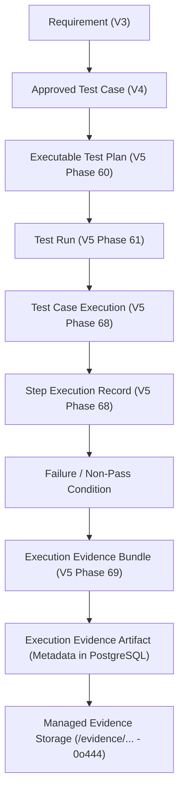
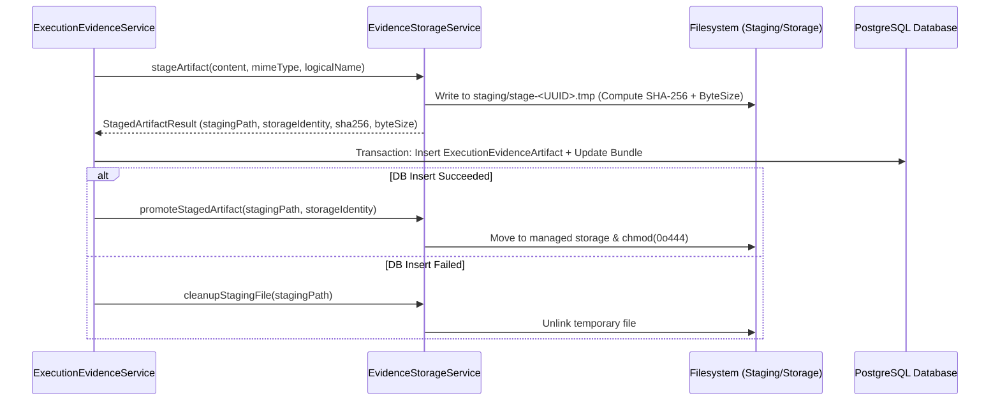

# Failure Evidence Capture Foundation (V5 Phase 69)

## 1. Executive Summary

Phase 69 establishes the durable, secure, immutable, and cryptographically verified foundation for browser-execution failure evidence within the **AI-Driven Software Quality Engineering Platform**.

Evidence cannot exist solely in transient browser memory, standard console logs, unmanaged temporary folders, or raw exception strings. In mission-critical software engineering, debugging and root-cause analysis require a forensic evidence trail with strong traceability, project isolation, secret redaction, and tampering defense.

Phase 69 establishes the **evidence architecture, storage engine, cryptographic validation, domain services, contracts, and desktop IPC bridge**. Phase 70 will subsequently connect live browser collectors (screenshots, traces, network Har, DOM snapshots) to this durable foundation.

---

## 2. The Authoritative Evidence Traceability Chain

Failure evidence forms the terminal evidentiary layer in the platform's complete quality lineage:



---

## 3. Evidence Data Model & Relational Schema

Evidence persistence is modeled with two core Prisma entities with cascading relational integrity:

### 3.1 Schema Definition

```prisma
enum EvidenceBundleStatus {
  PENDING
  COLLECTING
  COMPLETE
  PARTIAL
  FAILED
}

enum EvidenceArtifactType {
  SCREENSHOT
  PLAYWRIGHT_TRACE
  CONSOLE_LOG
  NETWORK_LOG
  NETWORK_REQUEST
  NETWORK_RESPONSE
  DOM_SNAPSHOT
  PAGE_METADATA
  ASSERTION_CONTEXT
  ERROR_CONTEXT
}

enum EvidenceRedactionStatus {
  NONE
  REDACTED
  PARTIALLY_REDACTED
}

enum EvidenceStorageRetentionStatus {
  ACTIVE
  EXPIRED
  DELETED
}

model ExecutionEvidenceBundle {
  id                    String                         @id @default(uuid()) @db.Uuid
  projectId             String                         @map("project_id") @db.Uuid
  testRunId             String                         @map("test_run_id") @db.Uuid
  executionId           String                         @map("execution_id") @db.Uuid
  stepExecutionId       String?                        @map("step_execution_id") @db.Uuid
  stepIndex             Int?                           @map("step_index")
  attempt               Int                            @default(1)
  status                EvidenceBundleStatus           @default(PENDING)
  failureTimestamp      DateTime?                      @map("failure_timestamp") @db.Timestamptz(6)
  collectionStartedAt   DateTime?                      @map("collection_started_at") @db.Timestamptz(6)
  collectionCompletedAt DateTime?                      @map("collection_completed_at") @db.Timestamptz(6)
  retentionStatus       EvidenceStorageRetentionStatus @default(ACTIVE) @map("retention_status")
  errorSummary          String?                        @map("error_summary") @db.Text
  metadataJson          Json                           @default("{}") @map("metadata_json")
  createdAt             DateTime                       @default(now()) @map("created_at") @db.Timestamptz(6)
  updatedAt             DateTime                       @default(now()) @updatedAt @map("updated_at") @db.Timestamptz(6)

  project       Project                      @relation(fields: [projectId], references: [id], onDelete: Cascade)
  testRun       TestRun                      @relation(fields: [testRunId], references: [id], onDelete: Cascade)
  execution     TestCaseExecution            @relation(fields: [executionId], references: [id], onDelete: Cascade)
  stepExecution StepExecutionRecord?         @relation(fields: [stepExecutionId], references: [id], onDelete: SetNull)
  artifacts     ExecutionEvidenceArtifact[]

  @@index([projectId])
  @@index([testRunId])
  @@index([executionId])
  @@index([stepExecutionId])
  @@index([status])
  @@index([createdAt])
  @@map("execution_evidence_bundles")
}

model ExecutionEvidenceArtifact {
  id                  String                  @id @default(uuid()) @db.Uuid
  projectId           String                  @map("project_id") @db.Uuid
  bundleId            String                  @map("bundle_id") @db.Uuid
  testRunId           String                  @map("test_run_id") @db.Uuid
  executionId         String                  @map("execution_id") @db.Uuid
  stepExecutionId     String?                 @map("step_execution_id") @db.Uuid
  artifactType        EvidenceArtifactType    @map("artifact_type")
  storageIdentity     String                  @map("storage_identity") @db.VarChar(128)
  originalLogicalName String                  @map("original_logical_name") @db.VarChar(255)
  mimeType            String                  @map("mime_type") @db.VarChar(100)
  byteSize            Int                     @map("byte_size")
  sha256              String                  @db.VarChar(64)
  redactionStatus     EvidenceRedactionStatus @default(NONE) @map("redaction_status")
  capturedAt          DateTime                @default(now()) @map("captured_at") @db.Timestamptz(6)
  persistedAt         DateTime                @default(now()) @map("persisted_at") @db.Timestamptz(6)
  metadataJson        Json                    @default("{}") @map("metadata_json")
  createdAt           DateTime                @default(now()) @map("created_at") @db.Timestamptz(6)

  project       Project                 @relation(fields: [projectId], references: [id], onDelete: Cascade)
  bundle        ExecutionEvidenceBundle @relation(fields: [bundleId], references: [id], onDelete: Cascade)
  testRun       TestRun                 @relation(fields: [testRunId], references: [id], onDelete: Cascade)
  execution     TestCaseExecution       @relation(fields: [executionId], references: [id], onDelete: Cascade)
  stepExecution StepExecutionRecord?    @relation(fields: [stepExecutionId], references: [id], onDelete: SetNull)

  @@index([projectId])
  @@index([bundleId])
  @@index([testRunId])
  @@index([executionId])
  @@index([stepExecutionId])
  @@index([artifactType])
  @@index([capturedAt])
  @@map("execution_evidence_artifacts")
}
```

---

## 4. Managed Storage & Security Architecture

### 4.1 Path Isolation & Traversal Protection

1. **Never Trust Client Paths**: The desktop renderer never sends raw filesystem paths. All operations are semantic: `getEvidenceArtifact({ projectId, artifactId })`.
2. **Backend UUID Storage Identities**: Files are saved with server-generated UUID tokens (`art_<UUID>.<ext>`), preventing filename collision and directory escape.
3. **Strict Path Traversal Validation**:
   - Every segment (`projectId`, `testRunId`, `executionId`, `storageIdentity`) is validated against `..`, `\`, `/`, `%2e%2e`, null bytes `\0`, and absolute path declarations.
   - Canonical resolved path must start strictly with the application-managed evidence root:
     `<storageRoot>/execution-evidence/<projectId>/<testRunId>/<executionId>/<storageIdentity>`

### 4.2 Staging, Promotion & Immutability Pipeline



### 4.3 Cryptographic Integrity & Forensic Verification

- **SHA-256 Checksum**: Computed on the raw payload stream during staging and stored in the database.
- **Tampering Detection**: When reading an artifact or verifying integrity, the SHA-256 hash of the stored file is recomputed. Any discrepancy triggers an `EvidenceIntegrityMismatchError`.

---

## 5. Defensive Secret Redaction

The `EvidenceRedactor` enforces zero leakage of credentials, tokens, or private secrets:

- **Metadata Objects**: Recursively scans and redacts keys containing `password`, `token`, `secret`, `auth`, `cookie`, `key`, `credential`, `jwt`, `bearer`.
- **URLs**: Redacts username/passwords in authority and sensitive query parameters (`password`, `token`, `auth_token`, `api_key`, `secret`, `code`, `sig`).
- **Text Logs**: Masked via regex patterns detecting Bearer tokens, Basic auth, JSON credential fields, and explicit password phrases.

---

## 6. IPC Channels & Preload API

Exposed safely under `window.desktop.evidence`:

| Method                       | Desktop Channel                          | Description                                                 |
| ---------------------------- | ---------------------------------------- | ----------------------------------------------------------- |
| `createBundle(input)`        | `desktop:evidence:create-bundle`         | Initializes an evidence bundle for an execution             |
| `addArtifact(input)`         | `desktop:evidence:add-artifact`          | Stages, hashes, persists, and promotes an evidence artifact |
| `finalizeBundle(input)`      | `desktop:evidence:finalize-bundle`       | Finalizes a bundle (`COMPLETE`, `PARTIAL`, `FAILED`)        |
| `getBundle(input)`           | `desktop:evidence:get-bundle`            | Retrieves bundle metadata with sorted artifacts             |
| `listBundles(input)`         | `desktop:evidence:list-bundles`          | Lists bundles with filtering and pagination                 |
| `listArtifacts(input)`       | `desktop:evidence:list-artifacts`        | Lists artifacts with filtering and pagination               |
| `getArtifactMetadata(input)` | `desktop:evidence:get-artifact-metadata` | Retrieves metadata for a single artifact                    |
| `verifyIntegrity(input)`     | `desktop:evidence:verify-integrity`      | Cryptographically verifies SHA-256 integrity                |

---

## 7. Operational Boundaries (Phase 69 vs Phase 70)

| Capability                                                           | Phase 69 (This Phase)     | Phase 70 (Next Phase)         |
| -------------------------------------------------------------------- | ------------------------- | ----------------------------- |
| Evidence Data Model & Relational Schema                              | **Complete & Certified**  | Read-only consumer            |
| Application-Managed Storage & 0o444 Immutability                     | **Complete & Certified**  | Storing collector output      |
| Streaming SHA-256 & Tampering Detection                              | **Complete & Certified**  | Validating collector output   |
| Path Traversal Defense & Isolation                                   | **Complete & Certified**  | Enforced                      |
| Defensive Secret Redaction                                           | **Complete & Certified**  | Applied to browser collectors |
| Live Playwright Browser Collectors (Screenshots, Traces, Video, DOM) | _Out of Scope (Phase 70)_ | **Target Implementation**     |
| AI-Powered Root-Cause Triage & Jira Integration                      | _Out of Scope (V6)_       | _Out of Scope (V6)_           |

---

## 8. Verification & Quality Certification

- **Evidence Unit & Security Tests**: `14/14 passed` (`evidence-storage-service.test.ts`)
- **Evidence Domain Integration Tests**: `11/11 passed` (`execution-evidence-service.test.ts`)
- **Evidence Desktop IPC Tests**: `8/8 passed` (`evidence-handlers.test.ts`)
- **Total Evidence Test Count**: `33/33 passed`
- **Platform Regression Pass**: `1,501/1,501 tests passed` (397 test suites across 229 test files with 0 failures)
- **Static Verification**: `npm run typecheck` (0 errors), `npm run lint` (0 errors), `npm run format:check` (100% clean)
- **Desktop Packaging & Smoke**: `npm run desktop:smoke` (passed), `npm run desktop:build` (passed, Preload 310.6kb)
