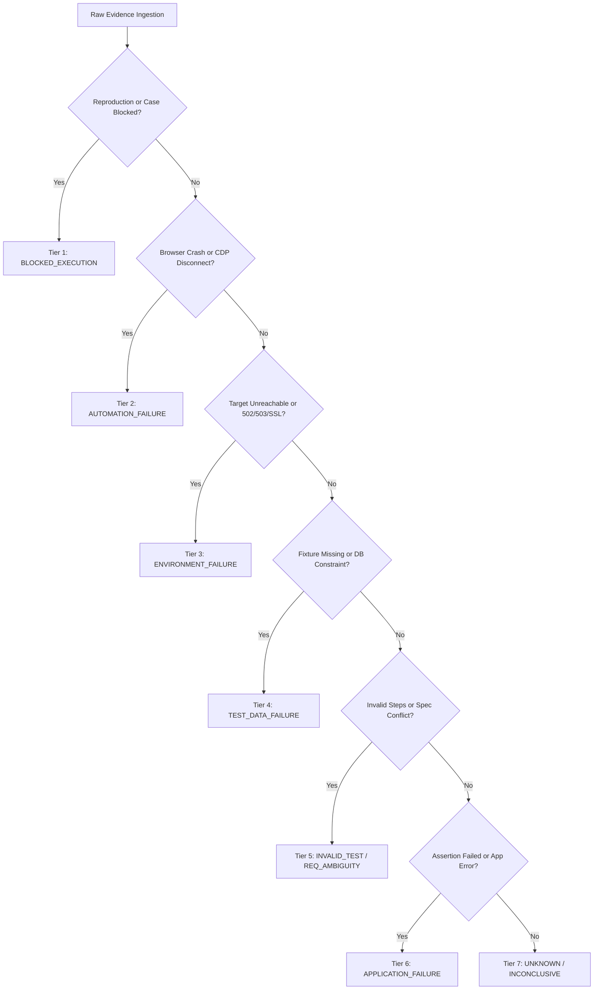

# V6 Phase 77 — Failure Taxonomy & Deterministic Classification Foundation

## 1. Overview & Executive Summary

The **Failure Taxonomy & Deterministic Classification Foundation** establishes an authoritative, reproducible, and explainable categorization engine for test failures detected across the platform. Operating strictly on verified execution evidence ($E_1$) and reproduction facts ($E_2$), this subsystem classifies failure cases without relying on probabilistic inference or LLMs.

### Versioning Constants

- **Taxonomy Version**: `1.0.0`
- **Classifier Version**: `1.0.0`

---

## 2. Core Architectural Principles

1. **Deterministic Rule-Based Ingestion**:
   - Every classification is derived strictly from observable facts: assertion outcomes, step status, exit codes, CDP/browser events, network status codes, and environment reachability metrics.
   - Zero heuristic guesswork, probabilistic models, or generative AI.
2. **Strict Rule Precedence Hierarchy**:
   - Conflicts between signals are resolved deterministically using a fixed precedence lattice:
     1. **`BLOCKED_EXECUTION`** (Precedence 100–199)
     2. **`AUTOMATION_FAILURE`** (Precedence 200–299)
     3. **`ENVIRONMENT_FAILURE`** (Precedence 300–399)
     4. **`TEST_DATA_FAILURE`** (Precedence 400–499)
     5. **`INVALID_TEST`** / **`REQUIREMENT_AMBIGUITY`** (Precedence 500–599)
     6. **`APPLICATION_FAILURE`** (Precedence 600–699)
     7. **`UNKNOWN`** / **`INCONCLUSIVE`** (Precedence 700–799)
3. **Strict Separation: `UNKNOWN` vs `INCONCLUSIVE`**:
   - **`UNKNOWN`**: Indicates **missing or incomplete evidence** (e.g. missing step execution records, missing artifacts, truncated logs). Classification cannot be deterministically inferred.
   - **`INCONCLUSIVE`**: Indicates **contradictory or irreconcilable factual signals** (e.g., target API returned `ERR_CONNECTION_REFUSED` while UI failed an element assertion, or reproduction produced `NOT_REPRODUCED` under a `DRIFTED` environment).
4. **Historical Execution Immutability ($E_1$)**:
   - Classification never alters raw test runs, test case executions, step execution records, or artifact files.
5. **Auditable Reclassification Lineage**:
   - Every failure case has at most one authoritative classification (`isAuthoritative: true`).
   - When reclassified, prior classifications have `isAuthoritative` set to `false` and point to the superseding record via `supersededById`.
   - A mandatory user or system reason (`reclassificationReason`) must be provided for every reclassification.

---

## 3. Authoritative Taxonomy Specification

### 3.1 Primary Failure Categories (9 Categories)

| Category                | Authoritative Definition                                                                                                               |
| :---------------------- | :------------------------------------------------------------------------------------------------------------------------------------- |
| `APPLICATION_FAILURE`   | Actual system under test deviated from expected behavior (assertion failure, 500 internal server error, unhandled frontend exception). |
| `AUTOMATION_FAILURE`    | Test execution harness failed (browser process crash, CDP disconnect, automation action timeout, frame detach).                        |
| `TEST_DATA_FAILURE`     | Test prerequisites or fixture data were missing, corrupted, or violated schema constraints (missing DB record, foreign key failure).   |
| `ENVIRONMENT_FAILURE`   | Test target was unreachable or unavailable (DNS failure, connection refused, 502/503/504 Bad Gateway, SSL failure).                    |
| `REQUIREMENT_AMBIGUITY` | Test failed due to ambiguous, contradictory, or conflicting requirement specifications.                                                |
| `INVALID_TEST`          | Test specification was structurally invalid, targeted non-existent selectors from outdated specs, or contained 0 steps.                |
| `BLOCKED_EXECUTION`     | Execution or analysis was halted prior to reaching test logic (blocked prerequisite, missing environment, manual blocker).             |
| `UNKNOWN`               | Mandatory execution evidence is absent or insufficient to derive a deterministic classification.                                       |
| `INCONCLUSIVE`          | Contradictory signals exist across failure domains, or reproduction diverged under a drifted environment.                              |

### 3.2 Factual Subcategories (26 Subcategories)

| Primary Category                                 | Subcategories                                                                                                                              |
| :----------------------------------------------- | :----------------------------------------------------------------------------------------------------------------------------------------- |
| `APPLICATION_FAILURE`                            | `ASSERTION_MISMATCH`, `APPLICATION_CRASH`, `APPLICATION_ERROR_RESPONSE`, `APPLICATION_CONSOLE_ERROR`, `APPLICATION_TIMEOUT`                |
| `AUTOMATION_FAILURE`                             | `BROWSER_CRASH`, `CDP_DISCONNECTED`, `PLAYWRIGHT_TIMEOUT`, `FRAME_DETACHED`, `ACTION_TARGET_DETACHED`, `PROTOCOL_ERROR`                    |
| `TEST_DATA_FAILURE`                              | `MISSING_TEST_DATA`, `EXPIRED_TEST_DATA`, `DATA_INTEGRITY_VIOLATION`, `FOREIGN_KEY_CONFLICT`                                               |
| `ENVIRONMENT_FAILURE`                            | `TARGET_UNREACHABLE`, `DNS_RESOLUTION_FAILED`, `CONNECTION_REFUSED`, `HTTP_5XX_GATEWAY_ERROR`, `SSL_CERTIFICATE_ERROR`, `ENVIRONMENT_DOWN` |
| `REQUIREMENT_AMBIGUITY`                          | `REQUIREMENT_INCONSISTENCY`, `SPECIFICATION_CONFLICT`                                                                                      |
| `INVALID_TEST`                                   | `INVALID_SELECTOR`, `TEST_DEFINITION_INVALID`                                                                                              |
| `BLOCKED_EXECUTION` / `UNKNOWN` / `INCONCLUSIVE` | `UNSPECIFIED_FAILURE`                                                                                                                      |

---

## 4. Deterministic Rule Registry & Precedence Matrix

Rules are evaluated deterministically in ascending precedence order:

### Registered Rules

| Rule ID                                  | Precedence | Category                | Subcategory                  | Match Condition                                                 | Signal Strength     |
| :--------------------------------------- | :--------- | :---------------------- | :--------------------------- | :-------------------------------------------------------------- | :------------------ |
| `BLK_REPRODUCTION_BLOCKED_001`           | 100        | `BLOCKED_EXECUTION`     | `UNSPECIFIED_FAILURE`        | Reproduction attempt status is `BLOCKED`                        | DEFINITIVE          |
| `BLK_ANALYSIS_BLOCKED_001`               | 110        | `BLOCKED_EXECUTION`     | `UNSPECIFIED_FAILURE`        | Failure case marked `BLOCKED` or ineligible                     | DEFINITIVE          |
| `AUTO_BROWSER_CRASH_001`                 | 200        | `AUTOMATION_FAILURE`    | `BROWSER_CRASH`              | Browser crash regex in logs or exit code 139                    | DEFINITIVE          |
| `AUTO_CDP_DISCONNECT_001`                | 210        | `AUTOMATION_FAILURE`    | `CDP_DISCONNECTED`           | CDP connection closed/reset                                     | DEFINITIVE          |
| `AUTO_ACTION_TIMEOUT_001`                | 220        | `AUTOMATION_FAILURE`    | `PLAYWRIGHT_TIMEOUT`         | Action timed out exceeding Playwright timeout                   | STRONG              |
| `AUTO_FRAME_DETACHED_001`                | 230        | `AUTOMATION_FAILURE`    | `FRAME_DETACHED`             | Execution context or target frame destroyed                     | STRONG              |
| `ENV_TARGET_UNREACHABLE_001`             | 300        | `ENVIRONMENT_FAILURE`   | `TARGET_UNREACHABLE`         | `ERR_CONNECTION_REFUSED`, `ENOTFOUND`                           | STRONG              |
| `ENV_HTTP_5XX_001`                       | 310        | `ENVIRONMENT_FAILURE`   | `HTTP_5XX_GATEWAY_ERROR`     | HTTP 502 Bad Gateway / 503 / 504 Gateway Timeout                | STRONG              |
| `ENV_SSL_CERT_ERROR_001`                 | 320        | `ENVIRONMENT_FAILURE`   | `SSL_CERTIFICATE_ERROR`      | `CERT_COMMON_NAME_INVALID`, SSL handshake fail                  | STRONG              |
| `DATA_REQUIRED_FIXTURE_MISSING_001`      | 400        | `TEST_DATA_FAILURE`     | `MISSING_TEST_DATA`          | Fixture not found / entity missing in test db                   | STRONG              |
| `DATA_INTEGRITY_VIOLATION_001`           | 410        | `TEST_DATA_FAILURE`     | `DATA_INTEGRITY_VIOLATION`   | Foreign key violation / unique constraint                       | STRONG              |
| `TEST_INVALID_STEPS_001`                 | 500        | `INVALID_TEST`          | `TEST_DEFINITION_INVALID`    | Test definition contains 0 steps (and evidence != INSUFFICIENT) | DEFINITIVE          |
| `REQ_AMBIGUITY_DETECTED_001`             | 510        | `REQUIREMENT_AMBIGUITY` | `REQUIREMENT_INCONSISTENCY`  | Requirement conflict or contradiction flagged                   | STRONG              |
| `APP_ASSERTION_MISMATCH_001`             | 600        | `APPLICATION_FAILURE`   | `ASSERTION_MISMATCH`         | Recorded assertion failed (strengthened if reproduced)          | STRONG / DEFINITIVE |
| `APP_HTTP_ERROR_001`                     | 610        | `APPLICATION_FAILURE`   | `APPLICATION_ERROR_RESPONSE` | HTTP 500 Internal Server Error                                  | STRONG              |
| `APP_CONSOLE_ERROR_001`                  | 620        | `APPLICATION_FAILURE`   | `APPLICATION_CONSOLE_ERROR`  | Unhandled frontend TypeError/ReferenceError                     | STRONG              |
| `UNKNOWN_INSUFFICIENT_EVIDENCE_001`      | 700        | `UNKNOWN`               | `UNSPECIFIED_FAILURE`        | Evidence completeness is INSUFFICIENT or logs absent            | DEFINITIVE          |
| `INCONCLUSIVE_CONTRADICTORY_SIGNALS_001` | 710        | `INCONCLUSIVE`          | `UNSPECIFIED_FAILURE`        | Contradictory signals (Env + App) or drift divergence           | STRONG              |

---

## 5. Security & Isolation Controls

1. **Project Isolation**:
   - Enforced across all IPC channels and core methods. Attempting to classify, read, or reclassify a failure case using a mismatched `projectId` throws `ClassificationCrossProjectError`.
2. **Mass-Assignment Protection**:
   - All inputs validated via Zod schemas (`classifyFailureInputSchema`, `reclassifyFailureInputSchema`). System fields (`classifierVersion`, `taxonomyVersion`, `primaryRuleId`, `isAuthoritative`, `supersededById`) cannot be injected by callers.
3. **IPC Sender Validation**:
   - Desktop IPC handlers strictly verify top-level frame invocation (`isTrustedSenderFrame`). Subframe calls are immediately rejected.
4. **Secret Redaction**:
   - `FailureEvidenceRedactor` masks Bearer tokens, passwords, API keys, and connection strings from rule explanations, supporting evidence, and reclassification reasons before persistence.

---

## 6. Desktop UI Panel: `ClassificationInspectionPanel`

The renderer features a dedicated **Classification (Phase 77)** tab:

- **Authoritative Category & Subcategory Badge**: Clear visual distinction with color-coded chips.
- **Rule Explanations Card**: Displays primary and matched rule IDs, human-readable explanations, and signal strength indicators (`DEFINITIVE`, `STRONG`, `SUGGESTIVE`).
- **Conflict Resolution Indicator**: Displays conflicting rule IDs when contradictory signals are reconciled.
- **Reclassification Workflow**: Accessible modal requiring a non-empty `reclassificationReason` to prevent accidental or unverified changes.
- **Audit History Drawer**: Chronological timeline of all historical classification records, showing which record superseded another.
