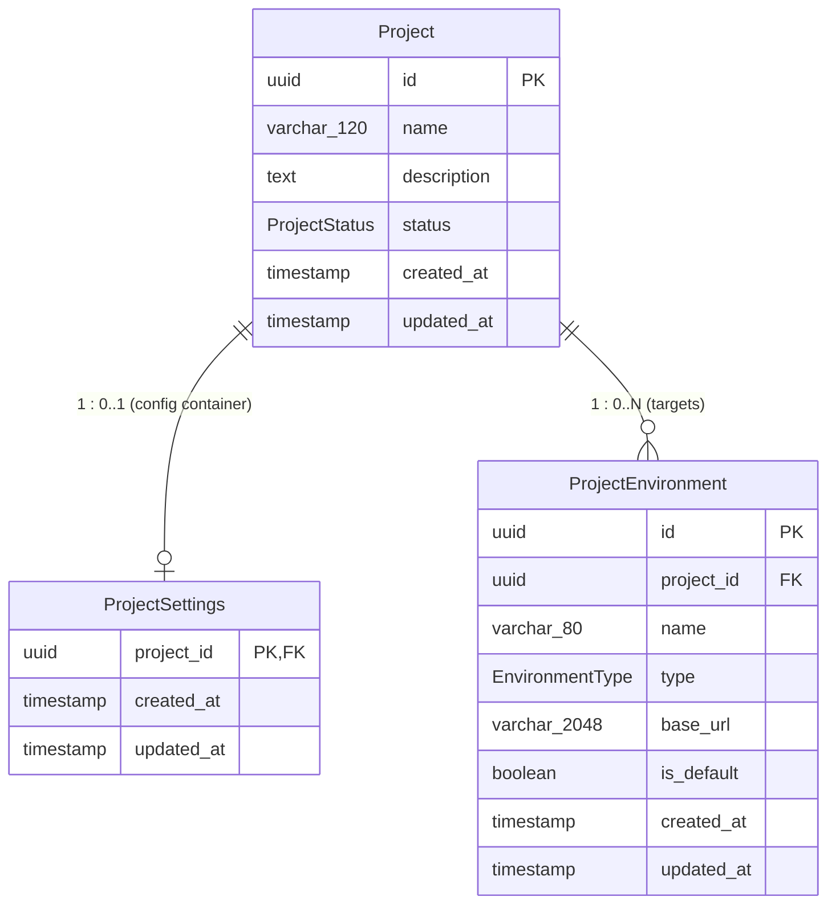

# Core Project Data Models

## AI-Driven Software Quality Engineering Platform

**Current Phase:** Version 1 — Phase 10: Core Project Data Models

---

## 1. Domain Overview & Entity Architecture

The platform's relational data model organizes quality engineering metadata hierarchically around a **Project**:



---

## 2. Models Specification

### 2.1. `Project` (Physical Table: `projects`)

Represents a top-level software system or product undergoing autonomous quality verification.

| Field         | Database Type   | Nullable |   Default    | Description                                      |
| :------------ | :-------------- | :------: | :----------: | :----------------------------------------------- |
| `id`          | `UUID`          |    No    |   `uuid()`   | Primary Key                                      |
| `name`        | `VARCHAR(120)`  |    No    |      —       | Project title (not globally unique; 1–120 chars) |
| `description` | `TEXT`          |   Yes    |    `NULL`    | Optional long-form project summary               |
| `status`      | `ProjectStatus` |    No    |  `'ACTIVE'`  | Project lifecycle state (`ACTIVE`, `ARCHIVED`)   |
| `createdAt`   | `TIMESTAMP(3)`  |    No    |   `now()`    | Record creation timestamp (`created_at`)         |
| `updatedAt`   | `TIMESTAMP(3)`  |    No    | `@updatedAt` | Automatic update timestamp (`updated_at`)        |

#### Indexes:

- `projects_status_idx` on `(status)`: Enables efficient status filtering (e.g. active vs archived).

---

### 2.2. `ProjectSettings` (Physical Table: `project_settings`)

A dedicated 1-to-1 extension container for project-level configurations.

| Field       | Database Type  | Nullable |   Default    | Description                                                        |
| :---------- | :------------- | :------: | :----------: | :----------------------------------------------------------------- |
| `projectId` | `UUID`         |    No    |      —       | Primary Key & Foreign Key (`project_id`) referencing `projects.id` |
| `createdAt` | `TIMESTAMP(3)` |    No    |   `now()`    | Record creation timestamp (`created_at`)                           |
| `updatedAt` | `TIMESTAMP(3)` |    No    | `@updatedAt` | Automatic update timestamp (`updated_at`)                          |

> [!NOTE]
> `ProjectSettings` is intentionally minimal in Phase 10. Concrete setting columns (e.g., test runner parameters, notification limits) will be added incrementally in later phases as features require them. Generic JSON blob columns (`settings Json`) are avoided to preserve schema clarity and type safety.

---

### 2.3. `ProjectEnvironment` (Physical Table: `project_environments`)

Represents a testable deployment environment or endpoint for a project (e.g., local dev server, QA staging server, production).

| Field       | Database Type     | Nullable |     Default     | Description                                          |
| :---------- | :---------------- | :------: | :-------------: | :--------------------------------------------------- |
| `id`        | `UUID`            |    No    |    `uuid()`     | Primary Key                                          |
| `projectId` | `UUID`            |    No    |        —        | Foreign Key (`project_id`) referencing `projects.id` |
| `name`      | `VARCHAR(80)`     |    No    |        —        | Environment label (e.g., "Local Dev", "Staging")     |
| `type`      | `EnvironmentType` |    No    | `'DEVELOPMENT'` | Environment classification                           |
| `baseUrl`   | `VARCHAR(2048)`   |   Yes    |     `NULL`      | Optional web application target URL (`base_url`)     |
| `isDefault` | `BOOLEAN`         |    No    |     `false`     | Default environment flag (`is_default`)              |
| `createdAt` | `TIMESTAMP(3)`    |    No    |     `now()`     | Record creation timestamp (`created_at`)             |
| `updatedAt` | `TIMESTAMP(3)`    |    No    |  `@updatedAt`   | Automatic update timestamp (`updated_at`)            |

---

## 3. Enums

### `ProjectStatus`

- `ACTIVE`: Project is open and undergoing active testing / test synthesis.
- `ARCHIVED`: Project is preserved for historical reference and read-only inspection.

### `EnvironmentType`

- `LOCAL`: Local development server (e.g., `http://localhost:3000`).
- `DEVELOPMENT`: Shared developer cloud environment.
- `TEST`: Dedicated QA and automated testing server.
- `STAGING`: Production-mirror pre-release environment.
- `PRODUCTION`: Live deployment environment.
- `CUSTOM`: User-defined special purpose target.

---

## 4. Relational Constraints & Database Rules

### 4.1. Name Uniqueness per Project

Environment names are unique within a project (`@@unique([projectId, name])`), while allowing different projects to share standard names like "Staging" or "Production".

### 4.2. At Most One Default Environment

A project may have **zero or one** default environment, but never multiple default environments. This is enforced at the PostgreSQL database level using a partial unique index:

```sql
CREATE UNIQUE INDEX "project_environments_project_id_default_idx"
ON "project_environments"("project_id")
WHERE "is_default" = true;
```

### 4.3. Cascade Deletion

- When a `Project` is deleted, its associated `ProjectSettings` and all child `ProjectEnvironment` records are automatically deleted via `ON DELETE CASCADE`.
- Deleting an individual `ProjectEnvironment` preserves the parent `Project` and sibling environments.

### 4.4. Security & Isolation Invariants

- `ProjectEnvironment.baseUrl` stores application target addresses. Plaintext passwords, bearer tokens, or sensitive credentials must **never** be stored in environment records.
- Prisma models and client instances remain privileged in `@ai-quality/core`. The React UI layer never directly imports database models or executes raw SQL queries.
