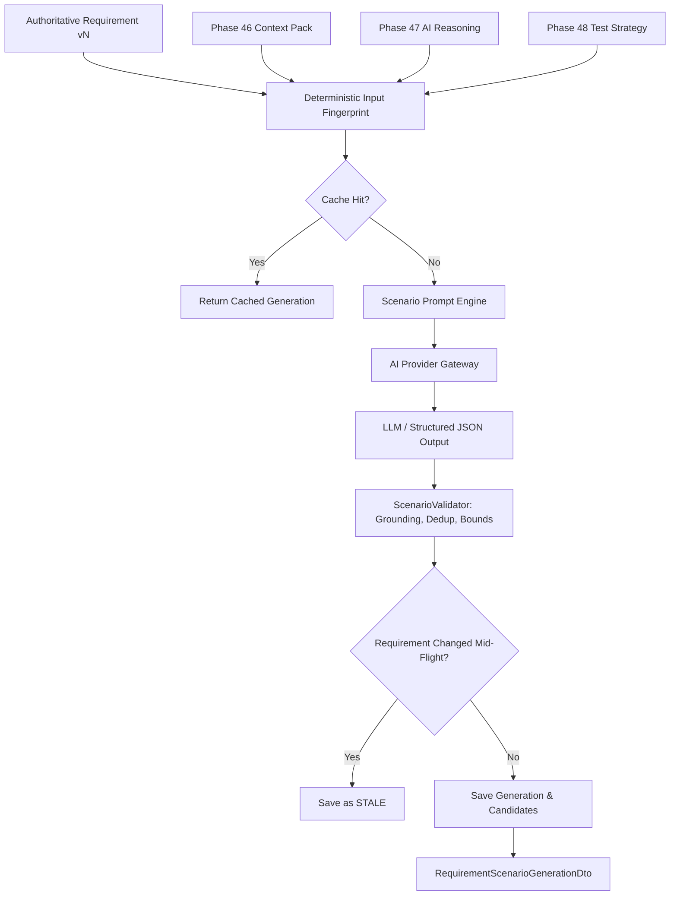

# V4 Phase 49 — Requirement-to-Test Scenario Generation

## 1. Overview & Architecture

Phase 49 implements the **Requirement-to-Test Scenario Generation Subsystem**, bridging requirement intelligence (V3), retrieved repository/architectural RAG context (Phase 46), LLM requirement analysis (Phase 47), and test design strategy (Phase 48) into high-level, grounded, reviewable test scenario candidates.

A test scenario in Phase 49 is a high-level statement defining **what should be tested and why**, bound to the exact version and state of the requirement.



---

## 2. Database Schema & Migration

### Migration: `20260821140000_init_requirement_scenarios`

#### Enum `ScenarioGenerationStatus`

- `GENERATED`: Scenario candidates successfully generated and active for the requirement version.
- `NO_SCENARIOS`: Requirement valid but yields no applicable scenarios.
- `INSUFFICIENT_INFORMATION`: Requirement lacks measurable criteria or is `NOT_TESTABLE`.
- `FAILED`: Generation failed during processing.
- `STALE`: Requirement was modified after this generation occurred.

#### Table `requirement_scenario_generations`

- `id` (`UUID`, PK)
- `project_id` (`UUID`, FK -> `projects.id`, ON DELETE CASCADE)
- `requirement_id` (`UUID`, FK -> `requirements.id`, ON DELETE CASCADE)
- `requirement_version_id` (`UUID`, FK -> `requirement_versions.id`, ON DELETE SET NULL)
- `requirement_version_number` (`INT`, snapshot)
- `status` (`ScenarioGenerationStatus`)
- `input_fingerprint` (`VARCHAR(64)`, deterministic sha256)
- `provider_id` (`VARCHAR(64)`)
- `model` (`VARCHAR(128)`)
- `prompt_id` (`VARCHAR(128)`)
- `prompt_version` (`INT`)
- `scenario_count` (`INT`)
- `warnings_json` (`JSONB`, default `[]`)
- `usage_json` (`JSONB`, default `{}`)
- `duration_ms` (`INT`)
- `error_message` (`TEXT`)
- `stale_at` (`TIMESTAMPTZ`)
- `created_at`, `updated_at` (`TIMESTAMPTZ`)

#### Table `requirement_scenario_candidates`

- `id` (`UUID`, PK)
- `generation_id` (`UUID`, FK -> `requirement_scenario_generations.id`, ON DELETE CASCADE)
- `project_id` (`UUID`, FK -> `projects.id`, ON DELETE CASCADE)
- `requirement_id` (`UUID`, FK -> `requirements.id`, ON DELETE CASCADE)
- `ordinal` (`INT`)
- `scenario_key` (`VARCHAR(64)`)
- `title` (`VARCHAR(256)`)
- `objective` (`TEXT`)
- `rationale` (`TEXT`)
- `requirement_aspect` (`VARCHAR(128)`)
- `test_level` (`VARCHAR(64)`, e.g., `UNIT`, `INTEGRATION`, `SYSTEM`, `E2E`)
- `test_intent` (`VARCHAR(64)`, e.g., `FUNCTIONAL`, `SECURITY`, `BOUNDARY`, `VALIDATION`)
- `applicability` (`VARCHAR(64)`)
- `assumptions_json` (`JSONB`, default `[]`)
- `source_evidence_refs_json` (`JSONB`, default `[]`)
- `created_at`, `updated_at` (`TIMESTAMPTZ`)

---

## 3. Grounding & Validation Engine (`ScenarioValidator`)

The validator enforces strict quality and safety boundaries on LLM outputs:

1. **Citation & Evidence Grounding**: Strips ungrounded evidence references that do not exist in the authoritative requirement or retrieved RAG context pack. Emits `UNGROUNDED_EVIDENCE_REF_STRIPPED` warnings.
2. **Title & Objective Deduplication**: Normalizes and deduplicates scenario candidates with identical or near-identical titles and objectives. Emits `DUPLICATE_SCENARIO_REMOVED` warnings.
3. **Hard Limit Bounds**: Clamps scenario candidate counts to `MAX_SCENARIO_CANDIDATES = 12` and scenario assumptions to `MAX_SCENARIO_ASSUMPTIONS = 5`.
4. **Preservation of Fidelity**: Enforces preservation of exact numbers, units, and negative/prohibitive modalities from the requirement statement.

---

## 4. Desktop IPC & Preload Bridge

### IPC Channels

- `desktop:scenarios:generate`: Generates candidate test scenarios for a requirement.
- `desktop:scenarios:get-current`: Fetches the current generation and candidate scenarios.
- `desktop:scenarios:get-history`: Fetches the generation history for auditability.
- `desktop:scenarios:regenerate`: Forces regeneration, marking prior generation `STALE`.

### Preload Bridge (`window.desktop.scenarios`)

```typescript
window.desktop.scenarios = {
  generate(input: GenerateScenariosInputDto): Promise<DesktopResult<RequirementScenarioGenerationDto>>,
  getCurrent(input: GetRequirementScenariosInputDto): Promise<DesktopResult<RequirementScenarioGenerationDto | null>>,
  getHistory(input: GetRequirementScenariosHistoryInputDto): Promise<DesktopResult<readonly RequirementScenarioGenerationDto[]>>,
  regenerate(input: RegenerateRequirementScenariosInputDto): Promise<DesktopResult<RequirementScenarioGenerationDto>>,
}
```

---

## 5. UI Integration

- **`RequirementScenariosView.tsx`**:
  - Displays scenario generation status badge, count, and engine metadata.
  - Interactive "Generate Candidate Scenarios" and "Regenerate Scenarios" buttons.
  - High-contrast scenario candidate cards showing:
    - `scenarioKey` & `title`
    - `testLevel` & `testIntent` badges
    - Clear `objective` and `rationale`
    - Highlighted `assumptions` when review is required
    - Grounding citations pills (`sourceEvidenceRefs`)
  - Warning banners for non-testable requirements (`INSUFFICIENT_INFORMATION`) and stale states.
- Embedded directly in `ViewRequirementModal.tsx` beneath Test Design Strategy.

---

## 6. Strict Phase 49 Boundary Compliance

- **No Detailed Test Variants (Phase 50)**: Does not create positive/negative/boundary/validation variant trees.
- **No Step-by-Step Test Steps or Preconditions (Phase 51)**: Scenarios specify high-level objectives and rationales, not test steps or data.
- **No Final TestCase Model (Phase 52)**: Persisted as `RequirementScenarioCandidate` records; no `TestCase` entities exist.
- **No Traceability Links or Coverage Matrix (Phases 54–55)**: Focuses exclusively on scenario candidate synthesis.
- **No Target Code Modification or Autonomous Playwright Execution**: Purely generative and reviewable test intelligence.

---

## 7. Verification Summary

- **Total Unit & Integration Tests**: 966 passed across 262 suites (100% pass rate).
- **Phase 49 Tests**:
  - `scenario-prompt-definition.test.ts` (4/4 passed)
  - `scenario-validator.test.ts` (3/3 passed)
  - `scenario-generation-service.test.ts` (6/6 passed)
  - `scenario-security.test.ts` (5/5 passed)
  - `scenario-handlers.test.ts` (5/5 passed)
- **Desktop Build & Smoke**: Passed (`dist/preload/index.cjs`, Vite bundle, Electron smoke test).
