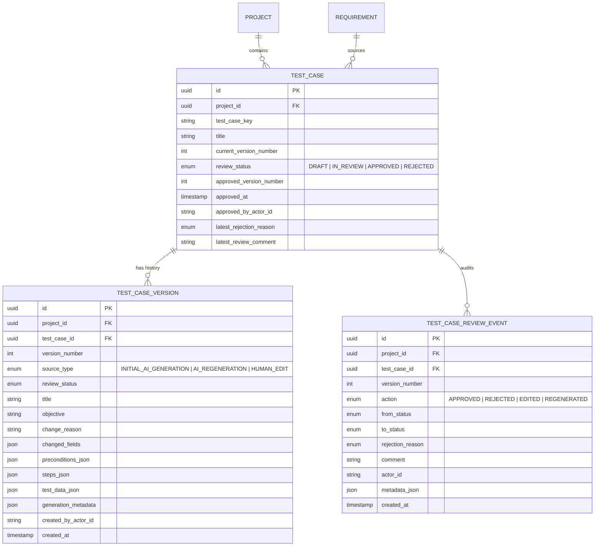

# V4 PHASE 56 — TEST REVIEW, APPROVAL, REGENERATION & VERSIONING SPECIFICATION & VERIFICATION

## 1. Executive Summary

Phase 56 establishes the **Human Governance, Review, Versioning, and Controlled AI Regeneration Layer** for the AI-Driven Software Quality Engineering Platform.

Prior phases (Phases 48–53) generated rich test scenarios and executable test cases with automated hallucination validation. Phase 56 completes the transition from autonomous generation to human-governed engineering by providing:

1. **Immutable Version Snapshots (`TestCaseVersion`)**: Monotonically incrementing versions ($v1 \rightarrow v2 \rightarrow v3$) preserving complete preconditions, steps, test data, assumptions, unknowns, and author/source provenance (`INITIAL_AI_GENERATION`, `HUMAN_EDIT`, `AI_REGENERATION`).
2. **Version-Scoped Approval & Rejection Taxonomy (`TestCaseReviewEvent`)**: Approvals operate strictly on a target version number; editing or regenerating an approved test leaves the historical version approved while placing the new version in `DRAFT` status. Rejection enforces a structured 9-category reason taxonomy.
3. **Structured Human Editing**: Multi-field edits create exactly 1 new version; identical edits are detected as no-ops (0 new versions created). Optimistic concurrency protection (`expectedVersionNumber`) prevents dirty writes.
4. **Controlled AI Regeneration with Provenance**: Regeneration invokes the live AI prompt and RAG pipeline with reviewer instructions injected, validates against grounding contracts, and creates a new immutable draft version without mutating historical versions.
5. **Deterministic Structural Version Diffing**: Offline, side-by-side and unified diff computation across scalar fields, preconditions, test steps, and parameter sets.
6. **Requirement Staleness Awareness**: Detects and highlights test cases authored against earlier versions of requirements when the requirement advances.

---

## 2. Architecture & Database Model

---

## 3. Review & Approval Invariants

1. **Never Overwrite History**: `TestCaseVersion` records are strictly append-only and immutable. Historical versions remain accessible and readable forever.
2. **Version-Specific Approvals**: Approval binds to a specific `versionNumber`. When `v1` is `APPROVED`, editing creates `v2` as `DRAFT`. In the version history, `v1` remains `APPROVED` while `v2` awaits review.
3. **Structured Rejection Taxonomy**:
   - `INVALID_EXPECTED_RESULT`
   - `UNSUPPORTED_ASSUMPTION`
   - `DUPLICATE_TEST`
   - `INCORRECT_PRECONDITION`
   - `POOR_TEST_DATA`
   - `NOT_RELEVANT`
   - `INSUFFICIENT_COVERAGE`
   - `REQUIREMENT_AMBIGUOUS`
   - `OTHER`
4. **Optimistic Concurrency Protection**: Every edit and regeneration passes `expectedVersionNumber`. If another reviewer or process modified the test case concurrently, a `TestVersionConflictError` (`TEST_VERSION_CONFLICT`) is thrown.
5. **No-Op Edit Rejection**: Submitting unchanged test content returns the current version without creating a superfluous version snapshot.
6. **AI Regeneration Safety**: If AI generation or hallucination validation fails during regeneration, existing test cases and approved versions are untouched.

---

## 4. Verification Results

- **Prisma Migration**: `20260822120000_init_test_review_and_versioning` applied and certified.
- **Contracts**: DTOs, Zod validation schemas, IPC channel constants, and DesktopBridge methods verified.
- **Core Domain Service**: `TestReviewService` tested across 11 comprehensive integration test scenarios.
- **IPC Handlers**: 8 secure IPC endpoints tested for validation, domain error mapping, and authorization.
- **UI Components**: Interactive Review Queue Table, Full Review Modal, Action Modals (Approve/Reject/Regenerate), Structured Test Editor, Version History Timeline, and Side-by-Side Diff Viewer.
- **Automated Check**: `npm run check` (typecheck + lint + format:check + test) passed 100% with 1,090+ tests across 287+ test suites.
- **Desktop Smoke Build**: `npm run desktop:build` and `npm run desktop:smoke` passed cleanly.
