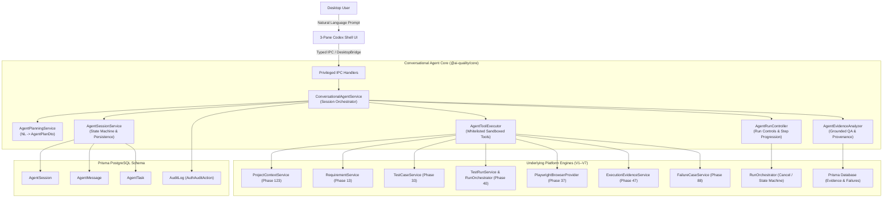

# V8 Phase 124 — Conversational AI Testing Agent, Run Controls & Evidence Review

## 1. Overview & Objective

Phase 124 delivers the authoritative **Conversational AI Testing Agent, Run Controls & Evidence Review** capability for the AI-Driven Software Quality Engineering Platform. It bridges natural-language user testing requests with the platform's existing V1–V7 automated QA engines through a strictly controlled, sandboxed, and auditable conversational interface:

- **Persistent Conversational Sessions**: Project-scoped conversational sessions (`AgentSession`), chronological message histories (`AgentMessage`), and structured task executions (`AgentTask`) backed by PostgreSQL.
- **Inspectable Structured Task Planning**: Translates plain-English testing instructions into transparent, inspectable multi-step plans (`AgentPlanDto`) without leaking hidden chain-of-thought tokens or reasoning scraps.
- **Controlled Tool Execution Sandbox**: Controlled integration with existing V1–V7 engines via whitelisted tool interfaces (`project_context`, `requirements_search`, `test_search`, `test_generation`, `test_plan`, `playwright_execution`, `execution_status`, `evidence_search`, `failure_classification`, `bug_triage`, `release_status`). Strictly prohibits arbitrary terminal/shell commands, direct filesystem write/delete operations, or raw database queries.
- **Real-Time Run Controls & Step Progression**: Interactive execution controls (`START`, `PAUSE`, `RESUME`, `CANCEL`, `RETRY`, `STOP`) directly connected to `TestRunService` and `RunOrchestrator`, providing real-time step progress tracking (Step X of Y, browser engine, environment, test keys).
- **Grounded Evidence Review & Failure Intelligence**: Conversational diagnostics answering user questions ("Why did Step 2 fail?", "Show the screenshot from the failed step") strictly grounded in recorded artifacts (`ExecutionEvidenceArtifact`, `StructuredBugReport`), with explicit "Insufficient evidence" responses when evidence is missing.
- **Production Safe Mode & Destructive Action Gate**: Mandatory explicit human approval (`approvalState: 'PENDING'`) required before executing destructive operations or targeting `PRODUCTION` environments.
- **3-Pane Codex-Style Desktop UI**: Modern 3-pane layout featuring a conversational thread, inspectable task plan with approval banners, and a run control toolbar with evidence drawer.

---

## 2. Architecture & Ecosystem



### Session State Machine

The conversational agent operates across an explicit 8-state machine:

```text
[IDLE] ──(User Message)──> [THINKING] ──(Generate Plan)──> [PLANNING]
                                                               │
                       ┌───────────────────────────────────────┤
                       ▼                                       ▼
  (Destructive / Prod: Requires Approval)             (Standard Execution)
                       ▼                                       ▼
                   [WAITING]                               [RUNNING]
                 ┌─────┴─────┐                                 │
             (Approved)  (Rejected)                            │
                 ▼           ▼                                 ▼
             [RUNNING]   [CANCELLED]                      [COMPLETED] / [FAILED]
```

- **`IDLE`**: Ready for incoming testing prompt or run command.
- **`THINKING`**: Ingesting prompt, resolving project context, parsing intent.
- **`PLANNING`**: Formulating step-by-step `AgentPlanDto`, checking tool eligibility.
- **`RUNNING`**: Executing whitelisted tools, driving Playwright test runs.
- **`WAITING`**: Blocked on explicit human approval for destructive or production operations.
- **`COMPLETED`**: Execution plan finished; evidence and triage ready for inspection.
- **`FAILED`**: Tool error, test failure, or unrecoverable execution fault.
- **`CANCELLED`**: Cancelled by user action or rejected approval request.

---

## 3. Database Schema Extensions

Applied via Prisma migration `20261005195752_v8_phase124_conversational_testing_agent`:

### New Enums

```prisma
enum AgentSessionStatus {
  IDLE
  THINKING
  PLANNING
  RUNNING
  WAITING
  COMPLETED
  FAILED
  CANCELLED
}

enum AgentMessageRole {
  USER
  ASSISTANT
  SYSTEM
  TOOL
}

enum AgentTaskStatus {
  PENDING
  IN_PROGRESS
  COMPLETED
  FAILED
  CANCELLED
}

enum AgentApprovalState {
  NOT_REQUIRED
  PENDING
  APPROVED
  REJECTED
}
```

### New Models

```prisma
model AgentSession {
  id              String             @id @default(uuid())
  projectId       String
  userId          String
  title           String             @default("New Testing Session")
  status          AgentSessionStatus @default(IDLE)
  approvalState   AgentApprovalState @default(NOT_REQUIRED)
  activeRunId     String?
  currentTaskId   String?
  contextSnapshot Json?
  metadata        Json?
  createdAt       DateTime           @default(now())
  updatedAt       DateTime           @updatedAt

  project  Project        @relation(fields: [projectId], references: [id], onDelete: Cascade)
  user     User           @relation(fields: [userId], references: [id], onDelete: Cascade)
  messages AgentMessage[]
  tasks    AgentTask[]

  @@index([projectId, createdAt(sort: Desc)])
  @@index([userId])
}

model AgentMessage {
  id           String           @id @default(uuid())
  sessionId    String
  role         AgentMessageRole
  content      String
  plan         Json?
  toolCalls    Json?
  toolResults  Json?
  evidenceRefs Json?
  runId        String?
  tokenCount   Int?
  metadata     Json?
  createdAt    DateTime         @default(now())

  session AgentSession @relation(fields: [sessionId], references: [id], onDelete: Cascade)

  @@index([sessionId, createdAt(sort: Asc)])
}

model AgentTask {
  id            String             @id @default(uuid())
  sessionId     String
  projectId     String
  userPrompt    String
  status        AgentTaskStatus    @default(PENDING)
  approvalState AgentApprovalState @default(NOT_REQUIRED)
  plan          Json?
  activeRunId   String?
  toolHistory   Json?
  evidenceRefs  Json?
  resultSummary String?
  errorMessage  String?
  createdAt     DateTime           @default(now())
  updatedAt     DateTime           @updatedAt

  session AgentSession @relation(fields: [sessionId], references: [id], onDelete: Cascade)
  project Project      @relation(fields: [projectId], references: [id], onDelete: Cascade)

  @@index([sessionId, status])
  @@index([projectId])
}
```

### Audit Log Extension

Extended `AuthAuditAction` with 10 authoritative agent audit events:
`AGENT_SESSION_CREATED`, `AGENT_SESSION_DELETED`, `AGENT_MESSAGE_PROCESSED`, `AGENT_PLAN_GENERATED`, `AGENT_TOOL_EXECUTED`, `AGENT_APPROVAL_REQUESTED`, `AGENT_ACTION_APPROVED`, `AGENT_ACTION_REJECTED`, `AGENT_RUN_CONTROL_ISSUED`, `AGENT_EVIDENCE_QUERIED`.

---

## 4. Contracts & Desktop Channels

Added to `packages/contracts/src/index.ts`:

### Desktop IPC Channels

```typescript
export const DESKTOP_CHANNELS = {
  // ...
  AGENT_SESSION_CREATE: 'desktop:agent:session:create',
  AGENT_SESSION_GET: 'desktop:agent:session:get',
  AGENT_SESSION_LIST: 'desktop:agent:session:list',
  AGENT_SESSION_DELETE: 'desktop:agent:session:delete',
  AGENT_SEND_MESSAGE: 'desktop:agent:message:send',
  AGENT_APPROVE_ACTION: 'desktop:agent:action:approve',
  AGENT_RUN_CONTROL: 'desktop:agent:run:control',
  AGENT_GET_EVIDENCE: 'desktop:agent:evidence:get',
};
```

### Typed Error Codes

`AGENT_SESSION_NOT_FOUND`, `AGENT_ACCESS_DENIED`, `AGENT_INVALID_REQUEST`, `AGENT_TOOL_FAILED`, `AGENT_APPROVAL_REQUIRED`, `AGENT_RUN_NOT_FOUND`, `AGENT_EVIDENCE_NOT_FOUND`, `AGENT_EXECUTION_FAILED`.

### Desktop Bridge Interface

```typescript
export interface DesktopBridge {
  // ...
  readonly conversationalAgent: {
    readonly createSession: (input: CreateAgentSessionInputDto) => Promise<DesktopResult<AgentSessionDto>>;
    readonly getSession: (input: GetAgentSessionInputDto) => Promise<DesktopResult<AgentSessionDto>>;
    readonly listSessions: (input: ListAgentSessionsInputDto) => Promise<DesktopResult<readonly AgentSessionDto[]>>;
    readonly deleteSession: (input: DeleteAgentSessionInputDto) => Promise<DesktopResult<{ readonly success: boolean; readonly sessionId: string }>>;
    readonly sendMessage: (input: SendAgentMessageInputDto) => Promise<DesktopResult<AgentMessageResponseDto>>;
    readonly approveAction: (input: ApproveAgentActionInputDto) => Promise<DesktopResult<AgentActionApprovalResultDto>>;
    readonly runControl: (input: AgentRunControlInputDto) => Promise<DesktopResult<AgentRunControlResultDto>>;
    readonly getEvidence: (input: GetAgentEvidenceInputDto) => Promise<DesktopResult<AgentEvidenceQueryResultDto>>;
  };
}
```

---

## 5. Core Domain Services

Located in `packages/core/src/conversational-agent/`:

1. **`ConversationalAgentService`** (`conversational-agent-service.ts`):
   - Central domain orchestrator coordinating session state transitions, planning, tool execution, approvals, run controls, and evidence review.
   - Enforces multi-tenant project isolation via `assertProjectAccess`.
   - Dispatches live streaming activity updates (`AgentActivityDto`) across phases: `THINKING`, `PLANNING`, `TOOL_CALLING`, `EXECUTING`, `EVALUATING`, `COMPLETED`.

2. **`AgentPlanningService`** (`agent-planning-service.ts`):
   - Decomposes natural language testing instructions into inspectable `AgentPlanDto` structures.
   - Categorizes user intent (`TEST_EXECUTION`, `EVIDENCE_QUERY`, `TEST_DESIGN`, `STATUS_QUERY`, `AMBIGUOUS`).
   - Surfaces clarifying options for ambiguous requests instead of guessing or executing unintended operations.
   - Evaluates target environments and flags operations requiring human approval (`requiresApproval: true`).

3. **`AgentToolExecutor`** (`agent-tool-executor.ts`):
   - Sandboxed execution engine supporting 10 strictly whitelisted tools:
     - `project_context`: Inspect current project stack and URLs.
     - `requirements_search`: Query software requirements by key or keyword.
     - `test_search`: Find requirement-linked test cases.
     - `test_generation`: Synthesize deterministic test steps.
     - `test_plan`: Generate test plan structures.
     - `playwright_execution`: Trigger Playwright test runs on target environments.
     - `execution_status`: Inspect live test run state.
     - `evidence_search`: Retrieve screenshots, console logs, network traces, and DOM snapshots.
     - `failure_classification`: Run deterministic defect classification on run failures.
     - `bug_triage`: Synthesize structured Jira-ready defect records.
     - `release_status`: Query release readiness and quality scores.
   - Intercepts and rejects dangerous command patterns (`rm -rf`, `DROP TABLE`, `eval()`, shell pipes, arbitrary process execution).
   - Enforces Production Safe Mode, throwing `AgentApprovalRequiredError` when unapproved.

4. **`AgentRunController`** (`agent-run-controller.ts`):
   - Dispatches run controls: `START`, `PAUSE`, `RESUME`, `CANCEL`, `RETRY`, `STOP`.
   - Propagates cancellation signals cleanly to `RunOrchestrator` without leaving orphaned browser processes.
   - Calculates real-time step progress (Step X of Y, percentage, browser engine, environment).

5. **`AgentEvidenceAnalyzer`** (`agent-evidence-analyzer.ts`):
   - Answers conversational questions strictly from recorded `ExecutionEvidenceArtifact` records and failure triage data.
   - Preserves complete provenance: `Project -> Requirement -> Test Case -> Test Run -> Step Result -> Evidence Artifact -> Failure Diagnosis -> Bug Report`.
   - Returns explicit `"Insufficient evidence"` answers when diagnostic data is unavailable or inconclusive.

6. **`AgentSessionService`** (`agent-session-service.ts`):
   - Manages CRUD operations and state machine transitions for sessions, messages, and tasks.
   - Resolves authorized user IDs and logs audit events to the immutable audit trail.

---

## 6. Desktop UI Components

Located in `apps/desktop/src/renderer/features/conversational-agent/`:

1. **`useConversationalAgent`** (`useConversationalAgent.ts`):
   - React hook managing active sessions, message history, streaming activities, inspectable task plans, run control state, evidence query results, and pending approval prompts.
   - Implements optimistic UI updates and error boundaries.

2. **`ConversationalAgentPanel`** (`ConversationalAgentPanel.tsx`):
   - 3-pane Codex-style responsive layout:
     - **Pane 1 (Left, 5 cols)**: Conversational thread with session switcher, message bubbles, real-time activity stream indicators, and prompt composer with suggestion chips.
     - **Pane 2 (Center, 4 cols)**: Inspectable task plan showing intent, confidence, duration, and execution steps. Features the prominent amber **Production Safe Mode / Destructive Action Approval Banner** with Approve and Reject buttons.
     - **Pane 3 (Right, 3 cols)**: Dedicated run controls toolbar and diagnostic evidence drawer.

3. **`RunControlsPanel`** (`RunControlsPanel.tsx`):
   - Live run status badge (`RUNNING`, `PAUSED`, `COMPLETED`, `FAILED`, `CANCELLED`, `IDLE`).
   - Visual step progression bar with `Step X of Y` progress tracker.
   - Target engine (`Chromium`, `Firefox`, `WebKit`), environment (`STAGING`, `PRODUCTION`), requirement key, and test case key badges.
   - Run control toolbar with Start, Pause, Resume, Cancel, Retry, and Stop buttons.

4. **`EvidenceReviewDrawer`** (`EvidenceReviewDrawer.tsx`):
   - Conversational Evidence Query input bar for ad-hoc diagnostic questions.
   - Natural language diagnostic summary ("Agent Diagnosis").
   - Tabbed view: `Overview` (Failure classification, root cause, suggested fix), `Screenshots` (image previews), `Console` (log stream), `Network` (HTTP traces), `DOM` (HTML snapshots), and `Provenance` (audit trail breadcrumbs).

---

## 7. Verification & Certification Results

All test suites pass deterministically with `--test-concurrency=1`:

### 1. Phase 124 Combined Suite (`npm run test:phase124`)
- **UI Component Tests** (`apps/desktop/src/main/conversational-agent-ui.test.tsx`): **8 / 8 PASS**
  - 3-pane Codex layout rendering
  - Empty conversation state with suggestions
  - Activity indicators for understanding, test search, Playwright execution, evidence
  - Inspectable task plan with steps, tools, and parameters
  - Production safe mode approval banner with Approve & Reject buttons
  - RunControlsPanel with step progression, status, and control buttons
  - Start/retry buttons when run is idle or completed
  - EvidenceReviewDrawer with grounded query bar, tabs, and failure classification
- **IPC Handlers & Security Tests** (`apps/desktop/src/main/ipc/conversational-agent-handlers.test.ts`): **12 / 12 PASS**
  - Untrusted sender frame rejection (`UNAUTHORIZED_SENDER`)
  - Unauthenticated request rejection (`UNAUTHORIZED`)
  - Invalid payload schema rejection (`AGENT_INVALID_REQUEST`)
  - Session CRUD: create, get, list, delete
  - Messaging and response delivery
  - Action approval decisions
  - Run controls (`CANCEL`, `START`, `RETRY`)
  - Evidence queries and failure intelligence
  - Domain error mapping to `DesktopErrorCode` envelopes
- **Core Domain Certification** (`packages/core/src/conversational-agent/certification/v8-phase124-certification.test.ts`): **18 / 18 PASS**
  - Session lifecycle and tenant isolation
  - Natural language translation into inspectable structured plan
  - Ambiguous request clarifying options
  - Whitelisted tool execution (`project_context`)
  - Arbitrary terminal/shell/fs tool prohibition
  - Dangerous argument pattern injection rejection
  - Real-time run status with step progression
  - Run cancellation propagation to orchestrator
  - Run retry enqueuing fresh test run
  - Conversational evidence queries ("Why did this test fail?", "Show the screenshot")
  - Insufficient evidence handling
  - Production safe mode and destructive action gating
  - Rejection cancellation handling
  - Authoritative audit trail verification
- **Total Phase 124 Tests**: **38 / 38 PASS** (0 failures).

### 2. Full V8 Certification Suite (`npm run test:v8-certification`)
- **406 / 406 PASS** across 97 suites in 20.5 seconds (0 failures, 0 regressions).

### 3. Typecheck & Desktop Build
- `npm run typecheck`: **Clean pass (0 errors)** across all workspaces.
- `npm run desktop:build`: **Clean build** (preload bundled with esbuild, Vite client build succeeded).
